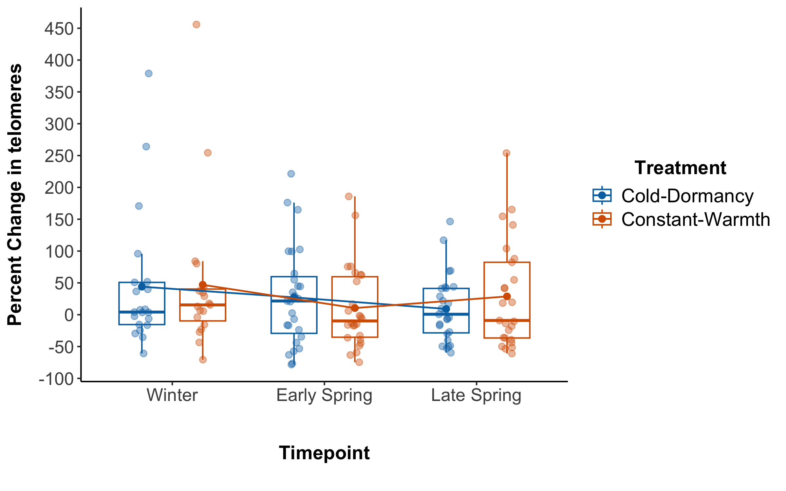
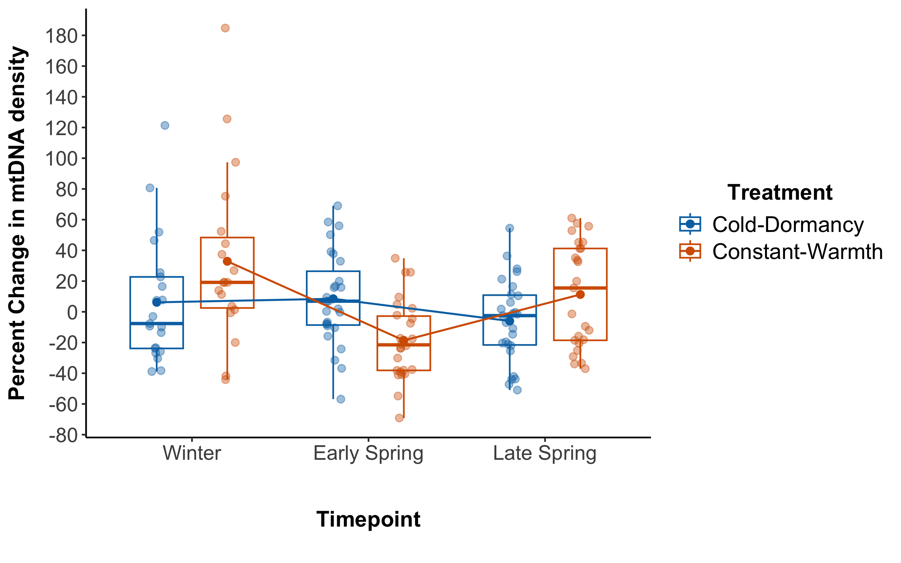

### Loading all the libraries that will be used in this code

``` r
library(dplyr) ## Will be used for specifying logical operators
library(stringr) ## Will be used to handle character vectors when modifying text data
library(tidyr) ## Will be used for reshaping the data for easier visualization later on
library(readr) ## Will be used when reading in .csv data
library(lme4) ## Will be used for mixed effect models with random and fixed effects 
library(emmeans) ## Will be used for post-hoc comparisons
library(ggplot2) ## Will be used for making graphs/data visualization 
```

# qPCR Data Preparation

## \#Process EDIT all the runs for EACH qPCR Plate of samples sepearately. Use the …Quantification Cq Results.csv files. Copy and paste the block of code and repeat on each plate of samples. You can use find replace for the dataset name, Plate1 for Plate2, etc.

# Plate 1

``` r
# Import .csv files for each run for a particular plate of samples 
Plate1_MPX <- read.csv("./Data/GT_Plate1_Multiplex_12_11_2024_Quantification_Cq_Results.csv")
dim (Plate1_MPX)
```

    ## [1] 188  16

``` r
Plate1_Telo <- read.csv("./Data/GT_Plate1_Telomeres_12_11_2024_Quantification_Cq_Results.csv")
dim (Plate1_Telo)
```

    ## [1] 94 16

``` r
# Concatenate data across runs for the same plate of samples
Plate1<- rbind(Plate1_MPX, Plate1_Telo)
dim(Plate1)
```

    ## [1] 282  16

``` r
# Add a column called PlateID and fill in correct Plate number to use as a variable in the statistics
Plate1$PlateID <- "Plate1"

# CHECK AND EDIT FOR YOUR DATA. 
#Name Correct Targets based on the fluorphores used in your reaction.
Plate1$Target[Plate1$Fluor == "VIC"] <- "scnag"
Plate1$Target[Plate1$Fluor == "FAM"] <- "mtdna"
Plate1$Target[Plate1$Fluor == "SYBR"] <- "telomeres"

############## Look for outliers - 1st round ##############

# Calculate the absolute difference from the mean Cq
Plate1$Diff_AVG_Cq <- abs(Plate1$Cq - Plate1$Cq.Mean)

# Identify outliers for mtdna and scnag samples based on >0.4 threshold
Plate1$Flag_outlier <- ifelse(Plate1$Target %in% c("mtdna", "scnag") &
Plate1$Diff_AVG_Cq > 0.4, "yes", "no")

# Identify outliers for telomeres based on >0.4 threshold
Plate1$Flag_outlier <- ifelse(Plate1$Target == "telomeres" &
Plate1$Diff_AVG_Cq > 0.4, "yes", Plate1$Flag_outlier)

# Report and examine high Cq samples in the first round
HighCq <- Plate1[Plate1$Flag_outlier == "yes", c("Well", "Sample", "Fluor",
"Diff_AVG_Cq")]
print(paste("Number of rows with high Cq in the first round:", nrow(HighCq)))
```

    ## [1] "Number of rows with high Cq in the first round: 8"

``` r
print(HighCq)
```

    ##      Well Sample Fluor Diff_AVG_Cq
    ## 51    E03 12.2_A   FAM   0.5306096
    ## 52    E04 12.2_A   FAM   0.5306096
    ## 63    F03 15.5_A   FAM   0.5237126
    ## 64    F04 15.5_A   FAM   0.5237126
    ## NA   <NA>   <NA>  <NA>          NA
    ## NA.1 <NA>   <NA>  <NA>          NA
    ## 177   H01    NEG   VIC   0.9500715
    ## 178   H02    NEG   VIC   0.9500714

``` r
# Remove outliers identified in the first round
Plate1 <- Plate1[Plate1$Flag_outlier != "yes", ]

# Verify the dimensions after removing outliers in the first round
print(dim(Plate1))
```

    ## [1] 276  19

``` r
############## Look for outliers - 2nd round ##############

# Recalculate Cq Mean and Starting Quantity Mean based on remaining data
Plate1 <- Plate1 %>%
  group_by(Sample, Target) %>%
  mutate(
    Cq.Mean2 = mean(Cq),
    Sq.Mean2 = mean(Starting.Quantity..SQ.)
  ) %>%
  ungroup()

# Calculate the new difference from the updated mean Cq
Plate1$Diff_AVG_Cq_2 <- abs(Plate1$Cq - Plate1$Cq.Mean2)

# Identify outliers in the second round based on >0.4 threshold for telomeres
Plate1$Flag_outlier_2 <- ifelse(Plate1$Target == "telomeres" & Plate1$Diff_AVG_Cq_2 >
0.4, "yes", "no")

# Report and examine high Cq samples in the second round for telomeres
HighCq_2 <- Plate1[Plate1$Target == "telomeres" & Plate1$Diff_AVG_Cq_2 > 0.4, 
c("Well", "Sample", "Fluor", "Diff_AVG_Cq_2")]
print(paste("Number of rows with high Cq in the second round for telomeres:", 
nrow(HighCq_2)))
```

    ## [1] "Number of rows with high Cq in the second round for telomeres: 2"

``` r
print(HighCq_2)
```

    ## # A tibble: 2 × 4
    ##   Well  Sample Fluor Diff_AVG_Cq_2
    ##   <chr> <chr>  <chr>         <dbl>
    ## 1 <NA>  <NA>   <NA>             NA
    ## 2 <NA>  <NA>   <NA>             NA

``` r
# Remove outliers identified in the second round for telomeres
Plate1 <- Plate1[!(Plate1$Target == "telomeres" & Plate1$Flag_outlier_2 == "yes"), ]

# Verify the dimensions after removing outliers in the second round
print(dim(Plate1))
```

    ## [1] 276  23

``` r
### Remove samples that do not have at least two rows
Plate1 <- Plate1 %>%
  group_by(Sample) %>%
  filter(n() >= 2) %>%
  ungroup()

# Final dimensions after all filtering steps
print(dim(Plate1))
```

    ## [1] 276  23

``` r
######### Remove negative controls and standards
# rows that have "NEG", "POS" in column "Sample" and remove rows with "STD" in Sample "Content"
Plate1 <- Plate1 %>%
  filter(!str_detect(Sample, "STD")) %>%
  filter(!str_detect(Sample, "NEG")) %>%
  filter(!str_detect(Sample, "POS")) 
dim(Plate1)
```

    ## [1] 234  23

``` r
######### Subset dataset based on the value in "Target" column
unique_targets <- unique(Plate1$Target)

# Create a list to store the subset dataframes
subset_dfs <- list()

# Loop through each unique value in 'Target', subset the dataframe, and store in subset_dfs
for (target_value in unique_targets) {
  subset_df <- subset(Plate1, Target == target_value)
  subset_dfs[[target_value]] <- subset_df
}


####### Now subset_dfs is a list where each element is a dataframe containing rows for each unique 'Target' value
Plate1_SCNAG<-print(subset_dfs[["scnag"]])
```

    ## # A tibble: 80 × 23
    ##    Well  Fluor X     Target Content Sample Biological.Set.Name    Cq Cq.Mean
    ##    <chr> <chr> <lgl> <chr>  <chr>   <chr>  <lgl>               <dbl>   <dbl>
    ##  1 A03   VIC   NA    scnag  Unkn-01 11.3_A NA                   28.0    27.9
    ##  2 A04   VIC   NA    scnag  Unkn-01 11.3_A NA                   27.9    27.9
    ##  3 A05   VIC   NA    scnag  Unkn-09 9.1_D  NA                   29.1    29.1
    ##  4 A06   VIC   NA    scnag  Unkn-09 9.1_D  NA                   29.1    29.1
    ##  5 A07   VIC   NA    scnag  Unkn-17 5.1_C  NA                   28.8    29.0
    ##  6 A08   VIC   NA    scnag  Unkn-17 5.1_C  NA                   29.1    29.0
    ##  7 A09   VIC   NA    scnag  Unkn-25 7.5_C  NA                   28.9    28.9
    ##  8 A10   VIC   NA    scnag  Unkn-25 7.5_C  NA                   28.9    28.9
    ##  9 A11   VIC   NA    scnag  Unkn-33 9.3_A  NA                   28.1    28.1
    ## 10 A12   VIC   NA    scnag  Unkn-33 9.3_A  NA                   28.0    28.1
    ## # ℹ 70 more rows
    ## # ℹ 14 more variables: Cq.Std..Dev <dbl>, Starting.Quantity..SQ. <dbl>,
    ## #   Log.Starting.Quantity <dbl>, SQ.Mean <dbl>, SQ.Std..Dev <dbl>,
    ## #   Set.Point <int>, Well.Note <lgl>, PlateID <chr>, Diff_AVG_Cq <dbl>,
    ## #   Flag_outlier <chr>, Cq.Mean2 <dbl>, Sq.Mean2 <dbl>, Diff_AVG_Cq_2 <dbl>,
    ## #   Flag_outlier_2 <chr>

``` r
Plate1_SCNAG<-Plate1_SCNAG[ ,c("PlateID", "Well", "Sample", "Target", "Cq", "Cq.Mean", 
"Flag_outlier", "SQ.Mean")]
Plate1_SCNAG <- Plate1_SCNAG %>% 
  rename(Target_SCNAG = Target, Cq_SCNAG = Cq, Cq.Mean_SCNAG = Cq.Mean, 
  Flag_outlier_SCNAG=Flag_outlier, SQ.Mean_SCNAG=SQ.Mean)

Plate1_mtDNA<-print(subset_dfs[["mtdna"]])
```

    ## # A tibble: 76 × 23
    ##    Well  Fluor X     Target Content Sample Biological.Set.Name    Cq Cq.Mean
    ##    <chr> <chr> <lgl> <chr>  <chr>   <chr>  <lgl>               <dbl>   <dbl>
    ##  1 A03   FAM   NA    mtdna  Unkn-01 11.3_A NA                   22.5    22.5
    ##  2 A04   FAM   NA    mtdna  Unkn-01 11.3_A NA                   22.5    22.5
    ##  3 A05   FAM   NA    mtdna  Unkn-09 9.1_D  NA                   23.1    23.1
    ##  4 A06   FAM   NA    mtdna  Unkn-09 9.1_D  NA                   23.1    23.1
    ##  5 A07   FAM   NA    mtdna  Unkn-17 5.1_C  NA                   22.9    23.1
    ##  6 A08   FAM   NA    mtdna  Unkn-17 5.1_C  NA                   23.4    23.1
    ##  7 A09   FAM   NA    mtdna  Unkn-25 7.5_C  NA                   22.7    22.7
    ##  8 A10   FAM   NA    mtdna  Unkn-25 7.5_C  NA                   22.8    22.7
    ##  9 A11   FAM   NA    mtdna  Unkn-33 9.3_A  NA                   22.1    22.2
    ## 10 A12   FAM   NA    mtdna  Unkn-33 9.3_A  NA                   22.2    22.2
    ## # ℹ 66 more rows
    ## # ℹ 14 more variables: Cq.Std..Dev <dbl>, Starting.Quantity..SQ. <dbl>,
    ## #   Log.Starting.Quantity <dbl>, SQ.Mean <dbl>, SQ.Std..Dev <dbl>,
    ## #   Set.Point <int>, Well.Note <lgl>, PlateID <chr>, Diff_AVG_Cq <dbl>,
    ## #   Flag_outlier <chr>, Cq.Mean2 <dbl>, Sq.Mean2 <dbl>, Diff_AVG_Cq_2 <dbl>,
    ## #   Flag_outlier_2 <chr>

``` r
Plate1_mtDNA<-Plate1_mtDNA[ ,c("PlateID", "Well", "Sample", "Target", "Cq", 
"Cq.Mean", "Flag_outlier", "SQ.Mean")]
Plate1_mtDNA <- Plate1_mtDNA %>% 
  rename(Target_mtDNA = Target, Cq_mtDNA = Cq, Cq.Mean_mtDNA = Cq.Mean, 
Flag_outlier_mtDNA = Flag_outlier, SQ.Mean_mtDNA = SQ.Mean)

Plate1_Telomeres<-print(subset_dfs[["telomeres"]])
```

    ## # A tibble: 78 × 23
    ##    Well  Fluor X     Target    Content Sample Biological.Set.Name    Cq Cq.Mean
    ##    <chr> <chr> <lgl> <chr>     <chr>   <chr>  <lgl>               <dbl>   <dbl>
    ##  1 A03   SYBR  NA    telomeres Unkn-01 11.3_A NA                   18.2    18.0
    ##  2 A04   SYBR  NA    telomeres Unkn-01 11.3_A NA                   17.9    18.0
    ##  3 A05   SYBR  NA    telomeres Unkn-09 9.1_D  NA                   18.1    18.0
    ##  4 A06   SYBR  NA    telomeres Unkn-09 9.1_D  NA                   18.0    18.0
    ##  5 A07   SYBR  NA    telomeres Unkn-17 5.1_C  NA                   18.8    18.8
    ##  6 A08   SYBR  NA    telomeres Unkn-17 5.1_C  NA                   18.7    18.8
    ##  7 A09   SYBR  NA    telomeres Unkn-25 7.5_C  NA                   18.6    18.5
    ##  8 A10   SYBR  NA    telomeres Unkn-25 7.5_C  NA                   18.4    18.5
    ##  9 A11   SYBR  NA    telomeres Unkn-33 9.3_A  NA                   18.1    18.1
    ## 10 A12   SYBR  NA    telomeres Unkn-33 9.3_A  NA                   18.1    18.1
    ## # ℹ 68 more rows
    ## # ℹ 14 more variables: Cq.Std..Dev <dbl>, Starting.Quantity..SQ. <dbl>,
    ## #   Log.Starting.Quantity <dbl>, SQ.Mean <dbl>, SQ.Std..Dev <dbl>,
    ## #   Set.Point <int>, Well.Note <lgl>, PlateID <chr>, Diff_AVG_Cq <dbl>,
    ## #   Flag_outlier <chr>, Cq.Mean2 <dbl>, Sq.Mean2 <dbl>, Diff_AVG_Cq_2 <dbl>,
    ## #   Flag_outlier_2 <chr>

``` r
Plate1_Telomeres<-Plate1_Telomeres[ ,c("PlateID", "Well", "Sample", "Target", 
"Cq", "Cq.Mean", "Flag_outlier", "SQ.Mean")]
Plate1_Telomeres <- Plate1_Telomeres %>%
  rename(Target_Telomeres = Target, Cq_Telomeres = Cq, Cq.Mean_Telomeres = Cq.Mean, 
  Flag_outlier_Telomeres = Flag_outlier, SQ.Mean_Telomeres = SQ.Mean)
  #rename(Cq_Telomeres = Cq, Cq.Mean_Telomeres = Cq.Mean, Flag_outlier_Telomeres = Flag_outlier, SQ.Mean_Telomeres = SQ.Mean)
  

#############  Make a final MPX dataset for by merging the Target datasets horizontally, in rows. 
Plate1_FinalMPX <- merge(Plate1_SCNAG, Plate1_mtDNA, by = c("PlateID", "Well", "Sample"))

############# Normalize mtDNA
# Add a column called mtDNA, and calculate the normalized value 
Plate1_FinalMPX$mtDNA <- (Plate1_FinalMPX$SQ.Mean_mtDNA / Plate1_FinalMPX$SQ.Mean_SCNAG)

# Recalculate mean across the replicates
Plate1_FinalMPX <- Plate1_FinalMPX %>%
  group_by(Sample) %>%
  mutate(
    mtDNA.Mean = mean(mtDNA)) %>%
  ungroup()

############## Merge final MPX with Telomeres
## Reduce datasets to single row per individual containing only the columns we want.
Plate1_FinalMPX <- distinct(Plate1_FinalMPX, PlateID, Sample, SQ.Mean_SCNAG, 
Cq.Mean_SCNAG, SQ.Mean_mtDNA, mtDNA.Mean)
Plate1_FinalTelo <- distinct(Plate1_Telomeres, PlateID, Sample, SQ.Mean_Telomeres, 
Cq.Mean_Telomeres)

## Merge the files horizontally
Plate1_FinalData <- merge(Plate1_FinalMPX, Plate1_FinalTelo, by = c("PlateID", "Sample"))

# Normalize Telomeres
Plate1_FinalData <- Plate1_FinalData %>% mutate(Telomeres.per.cell = SQ.Mean_Telomeres / 
SQ.Mean_SCNAG)

# Assuming Plate1_FinalData has been prepared as per your previous steps

# Aggregate to get one row per sample, taking mean of normalized mtDNA and telomeres
Plate1_FinalData <- Plate1_FinalData %>%
  group_by(Sample) %>%
  summarize(
    SQ.Mean_SCNAG = mean(SQ.Mean_SCNAG),
    SQ.Mean_mtDNA = mean(SQ.Mean_mtDNA),
    mtDNA.Mean = mean(mtDNA.Mean),
    Cq.Mean_SCNAG = mean(Cq.Mean_SCNAG),
    SQ.Mean_Telomeres = mean(SQ.Mean_Telomeres),
    Cq.Mean_Telomeres = mean(Cq.Mean_Telomeres),
    Telomeres.per.cell = mean(Telomeres.per.cell)
  ) %>%
  ungroup()

# Write the final data file for this plate
write.csv(file = "./Data/Plate1_FinalData.csv", Plate1_FinalData, row.names = FALSE)
```

# Plate 2

``` r
# Clear memory
rm(list=ls(all = TRUE))

# Import .csv files for each run for a particular plate of samples 
Plate2_MPX <- read.csv("./Data/GT_Plate2_Multiplex_12_12_2024_Quantification_Cq_Results.csv")
dim (Plate2_MPX)
```

    ## [1] 188  16

``` r
Plate2_Telo <- read.csv("./Data/GT_Plate2_Telomeres_12_12_2024_Quantification_Cq_Results.csv")
dim (Plate2_Telo)
```

    ## [1] 88 16

``` r
# Concatenate data across runs for the same plate of samples
Plate2<- rbind(Plate2_MPX, Plate2_Telo)
dim(Plate2)
```

    ## [1] 276  16

``` r
# Add a column called PlateID and fill in correct Plate number to use as a variable in the statistics
Plate2$PlateID <- "Plate2"

# CHECK AND EDIT FOR YOUR DATA. 
#Name Correct Targets based on the fluorphores used in your reaction.
Plate2$Target[Plate2$Fluor == "VIC"] <- "scnag"
Plate2$Target[Plate2$Fluor == "FAM"] <- "mtdna"
Plate2$Target[Plate2$Fluor == "SYBR"] <- "telomeres"

############## Look for outliers - 1st round ##############

# Calculate the absolute difference from the mean Cq
Plate2$Diff_AVG_Cq <- abs(Plate2$Cq - Plate2$Cq.Mean)

# Identify outliers for mtdna and scnag samples based on >0.4 threshold
Plate2$Flag_outlier <- ifelse(Plate2$Target %in% c("mtdna", "scnag") & 
Plate2$Diff_AVG_Cq > 0.4, "yes", "no")

# Identify outliers for telomeres based on >0.4 threshold
Plate2$Flag_outlier <- ifelse(Plate2$Target == "telomeres" &
Plate2$Diff_AVG_Cq > 0.4, "yes", Plate2$Flag_outlier)

# Report and examine high Cq samples in the first round
HighCq <- Plate2[Plate2$Flag_outlier == "yes", c("Well", "Sample", "Fluor", "Diff_AVG_Cq")]
print(paste("Number of rows with high Cq in the first round:", nrow(HighCq)))
```

    ## [1] "Number of rows with high Cq in the first round: 6"

``` r
print(HighCq)
```

    ##      Well Sample Fluor Diff_AVG_Cq
    ## 41    D05 12.2_D   FAM   0.5404402
    ## 42    D06 12.2_D   FAM   0.5404402
    ## NA   <NA>   <NA>  <NA>          NA
    ## NA.1 <NA>   <NA>  <NA>          NA
    ## NA.2 <NA>   <NA>  <NA>          NA
    ## NA.3 <NA>   <NA>  <NA>          NA

``` r
# Remove outliers identified in the first round
Plate2 <- Plate2[Plate2$Flag_outlier != "yes", ]

# Verify the dimensions after removing outliers in the first round
print(dim(Plate2))
```

    ## [1] 274  19

``` r
############## Look for outliers - 2nd round ##############

# Recalculate Cq Mean and Starting Quantity Mean based on remaining data
Plate2 <- Plate2 %>%
  group_by(Sample, Target) %>%
  mutate(
    Cq.Mean2 = mean(Cq),
    Sq.Mean2 = mean(Starting.Quantity..SQ.)
  ) %>%
  ungroup()

# Calculate the new difference from the updated mean Cq
Plate2$Diff_AVG_Cq_2 <- abs(Plate2$Cq - Plate2$Cq.Mean2)

# Identify outliers in the second round based on >0.4 threshold for telomeres
Plate2$Flag_outlier_2 <- ifelse(Plate2$Target == "telomeres" & Plate2$Diff_AVG_Cq_2 >
0.4, "yes", "no")

# Report and examine high Cq samples in the second round for telomeres
HighCq_2 <- Plate2[Plate2$Target == "telomeres" & Plate2$Diff_AVG_Cq_2 > 0.4,
c("Well", "Sample", "Fluor", "Diff_AVG_Cq_2")]
print(paste("Number of rows with high Cq in the second round for telomeres:",
nrow(HighCq_2)))
```

    ## [1] "Number of rows with high Cq in the second round for telomeres: 4"

``` r
print(HighCq_2)
```

    ## # A tibble: 4 × 4
    ##   Well  Sample Fluor Diff_AVG_Cq_2
    ##   <chr> <chr>  <chr>         <dbl>
    ## 1 <NA>  <NA>   <NA>             NA
    ## 2 <NA>  <NA>   <NA>             NA
    ## 3 <NA>  <NA>   <NA>             NA
    ## 4 <NA>  <NA>   <NA>             NA

``` r
# Remove outliers identified in the second round for telomeres
Plate2 <- Plate2[!(Plate2$Target == "telomeres" & Plate2$Flag_outlier_2 == "yes"), ]

# Verify the dimensions after removing outliers in the second round
print(dim(Plate2))
```

    ## [1] 274  23

``` r
### Remove samples that do not have at least two rows
Plate2 <- Plate2 %>%
  group_by(Sample) %>%
  filter(n() >= 2) %>%
  ungroup()

# Final dimensions after all filtering steps
print(dim(Plate2))
```

    ## [1] 274  23

``` r
######### Remove negative controls and standards
# rows that have "NEG", "POS" in column "Sample" and remove rows with "STD" in Sample "Content"
Plate2 <- Plate2 %>%
  filter(!str_detect(Sample, "STD")) %>%
  filter(!str_detect(Sample, "NEG")) 
dim(Plate2)
```

    ## [1] 236  23

``` r
######### Subset dataset based on the value in "Target" column
unique_targets <- unique(Plate2$Target)

# Create a list to store the subset dataframes
subset_dfs <- list()

# Loop through each unique value in 'Target', subset the dataframe, and store in subset_dfs

for (target_value in unique_targets) {
  subset_df <- subset(Plate2, Target == target_value)
  subset_dfs[[target_value]] <- subset_df
}

#############
#############Now subset_dfs is a list where each element is a dataframe containing rows for each unique 'Target' value
Plate2_SCNAG<-print(subset_dfs[["scnag"]])
```

    ## # A tibble: 80 × 23
    ##    X     Well  Fluor Target Content Sample Biological.Set.Name    Cq Cq.Mean
    ##    <lgl> <chr> <chr> <chr>  <chr>   <chr>  <lgl>               <dbl>   <dbl>
    ##  1 NA    A03   VIC   scnag  Unkn-01 15.3_D NA                   29.5    29.3
    ##  2 NA    A04   VIC   scnag  Unkn-01 15.3_D NA                   29.1    29.3
    ##  3 NA    A05   VIC   scnag  Unkn-09 5.5_A  NA                   28.8    28.8
    ##  4 NA    A06   VIC   scnag  Unkn-09 5.5_A  NA                   28.8    28.8
    ##  5 NA    A07   VIC   scnag  Unkn-17 6.3_D  NA                   29.7    29.8
    ##  6 NA    A08   VIC   scnag  Unkn-17 6.3_D  NA                   29.9    29.8
    ##  7 NA    A09   VIC   scnag  Unkn-25 10.1_C NA                   29.9    29.8
    ##  8 NA    A10   VIC   scnag  Unkn-25 10.1_C NA                   29.7    29.8
    ##  9 NA    A11   VIC   scnag  Unkn-33 15.1_C NA                   28.2    28.2
    ## 10 NA    A12   VIC   scnag  Unkn-33 15.1_C NA                   28.2    28.2
    ## # ℹ 70 more rows
    ## # ℹ 14 more variables: Cq.Std..Dev <dbl>, Starting.Quantity..SQ. <dbl>,
    ## #   Log.Starting.Quantity <dbl>, SQ.Mean <dbl>, SQ.Std..Dev <dbl>,
    ## #   Set.Point <int>, Well.Note <lgl>, PlateID <chr>, Diff_AVG_Cq <dbl>,
    ## #   Flag_outlier <chr>, Cq.Mean2 <dbl>, Sq.Mean2 <dbl>, Diff_AVG_Cq_2 <dbl>,
    ## #   Flag_outlier_2 <chr>

``` r
Plate2_SCNAG<-Plate2_SCNAG[ ,c("PlateID", "Well", "Sample", "Target", "Cq", "Cq.Mean",
"Flag_outlier", "SQ.Mean")]
Plate2_SCNAG <- Plate2_SCNAG %>% 
  rename(Target_SCNAG = Target, Cq_SCNAG = Cq, Cq.Mean_SCNAG = Cq.Mean,
  Flag_outlier_SCNAG=Flag_outlier, SQ.Mean_SCNAG=SQ.Mean)

Plate2_mtDNA<-print(subset_dfs[["mtdna"]])
```

    ## # A tibble: 78 × 23
    ##    X     Well  Fluor Target Content Sample Biological.Set.Name    Cq Cq.Mean
    ##    <lgl> <chr> <chr> <chr>  <chr>   <chr>  <lgl>               <dbl>   <dbl>
    ##  1 NA    A03   FAM   mtdna  Unkn-01 15.3_D NA                   22.7    22.5
    ##  2 NA    A04   FAM   mtdna  Unkn-01 15.3_D NA                   22.4    22.5
    ##  3 NA    A05   FAM   mtdna  Unkn-09 5.5_A  NA                   22.8    22.8
    ##  4 NA    A06   FAM   mtdna  Unkn-09 5.5_A  NA                   22.8    22.8
    ##  5 NA    A07   FAM   mtdna  Unkn-17 6.3_D  NA                   23.2    23.3
    ##  6 NA    A08   FAM   mtdna  Unkn-17 6.3_D  NA                   23.3    23.3
    ##  7 NA    A09   FAM   mtdna  Unkn-25 10.1_C NA                   23.1    23.1
    ##  8 NA    A10   FAM   mtdna  Unkn-25 10.1_C NA                   23.1    23.1
    ##  9 NA    A11   FAM   mtdna  Unkn-33 15.1_C NA                   22.2    22.2
    ## 10 NA    A12   FAM   mtdna  Unkn-33 15.1_C NA                   22.1    22.2
    ## # ℹ 68 more rows
    ## # ℹ 14 more variables: Cq.Std..Dev <dbl>, Starting.Quantity..SQ. <dbl>,
    ## #   Log.Starting.Quantity <dbl>, SQ.Mean <dbl>, SQ.Std..Dev <dbl>,
    ## #   Set.Point <int>, Well.Note <lgl>, PlateID <chr>, Diff_AVG_Cq <dbl>,
    ## #   Flag_outlier <chr>, Cq.Mean2 <dbl>, Sq.Mean2 <dbl>, Diff_AVG_Cq_2 <dbl>,
    ## #   Flag_outlier_2 <chr>

``` r
Plate2_mtDNA<-Plate2_mtDNA[ ,c("PlateID", "Well", "Sample", "Target", "Cq",
"Cq.Mean", "Flag_outlier", "SQ.Mean")]
Plate2_mtDNA <- Plate2_mtDNA %>% 
  rename(Target_mtDNA = Target, Cq_mtDNA = Cq, Cq.Mean_mtDNA = Cq.Mean, 
  Flag_outlier_mtDNA = Flag_outlier, SQ.Mean_mtDNA = SQ.Mean)

Plate2_Telomeres<-print(subset_dfs[["telomeres"]])
```

    ## # A tibble: 78 × 23
    ##    X     Well  Fluor Target    Content Sample Biological.Set.Name    Cq Cq.Mean
    ##    <lgl> <chr> <chr> <chr>     <chr>   <chr>  <lgl>               <dbl>   <dbl>
    ##  1 NA    A03   SYBR  telomeres Unkn-01 15.3_D NA                   18.4    18.4
    ##  2 NA    A04   SYBR  telomeres Unkn-01 15.3_D NA                   18.4    18.4
    ##  3 NA    A05   SYBR  telomeres Unkn-09 5.5_A  NA                   18.3    18.4
    ##  4 NA    A06   SYBR  telomeres Unkn-09 5.5_A  NA                   18.4    18.4
    ##  5 NA    A07   SYBR  telomeres Unkn-17 6.3_D  NA                   18.7    18.8
    ##  6 NA    A08   SYBR  telomeres Unkn-17 6.3_D  NA                   19.0    18.8
    ##  7 NA    A09   SYBR  telomeres Unkn-25 10.1_C NA                   18.2    18.3
    ##  8 NA    A10   SYBR  telomeres Unkn-25 10.1_C NA                   18.3    18.3
    ##  9 NA    A11   SYBR  telomeres Unkn-33 15.1_C NA                   18.2    18.3
    ## 10 NA    A12   SYBR  telomeres Unkn-33 15.1_C NA                   18.4    18.3
    ## # ℹ 68 more rows
    ## # ℹ 14 more variables: Cq.Std..Dev <dbl>, Starting.Quantity..SQ. <dbl>,
    ## #   Log.Starting.Quantity <dbl>, SQ.Mean <dbl>, SQ.Std..Dev <dbl>,
    ## #   Set.Point <int>, Well.Note <lgl>, PlateID <chr>, Diff_AVG_Cq <dbl>,
    ## #   Flag_outlier <chr>, Cq.Mean2 <dbl>, Sq.Mean2 <dbl>, Diff_AVG_Cq_2 <dbl>,
    ## #   Flag_outlier_2 <chr>

``` r
Plate2_Telomeres<-Plate2_Telomeres[ ,c("PlateID", "Well", "Sample", "Target",
"Cq", "Cq.Mean", "Flag_outlier", "SQ.Mean")]
Plate2_Telomeres <- Plate2_Telomeres %>% 
  rename(Target_Telomeres = Target, Cq_Telomeres = Cq, Cq.Mean_Telomeres = Cq.Mean,
  Flag_outlier_Telomeres = Flag_outlier, SQ.Mean_Telomeres = SQ.Mean)
  #rename(Cq_Telomeres = Cq, Cq.Mean_Telomeres = Cq.Mean, Flag_outlier_Telomeres = Flag_outlier, SQ.Mean_Telomeres = SQ.Mean)

###############. Make a final MPX dataset for by merging the Target datasets horizontally, in rows. 
Plate2_FinalMPX <- merge(Plate2_SCNAG, Plate2_mtDNA, by = c("PlateID", "Well", "Sample"))

############# Normalize mtDNA
# Add a column called mtDNA, and calculate the normalized value 
Plate2_FinalMPX$mtDNA <- (Plate2_FinalMPX$SQ.Mean_mtDNA / Plate2_FinalMPX$SQ.Mean_SCNAG)

# Recalculate mean across the replicates
Plate2_FinalMPX <- Plate2_FinalMPX %>%
  group_by(Sample) %>%
  mutate(
    mtDNA.Mean = mean(mtDNA)) %>%
  ungroup()

############## Merge final MPX with Telomeres
## Reduce datasets to single row per individual containing only the columns we want.
Plate2_FinalMPX <- distinct(Plate2_FinalMPX, PlateID, Sample, SQ.Mean_SCNAG,
Cq.Mean_SCNAG, SQ.Mean_mtDNA, mtDNA.Mean)
Plate2_FinalTelo <- distinct(Plate2_Telomeres, PlateID, Sample, SQ.Mean_Telomeres,
Cq.Mean_Telomeres)

## Merge the files horizontally
Plate2_FinalData <- merge(Plate2_FinalMPX, Plate2_FinalTelo, by = c("PlateID", "Sample"))

# Normalize Telomeres
Plate2_FinalData <- Plate2_FinalData %>% mutate(Telomeres.per.cell = SQ.Mean_Telomeres /
SQ.Mean_SCNAG)

# Assuming Plate2_FinalData has been prepared as per your previous steps

# Aggregate to get one row per sample, taking mean of normalized mtDNA and telomeres
Plate2_FinalData <- Plate2_FinalData %>%
  group_by(Sample) %>%
  summarize(
    SQ.Mean_SCNAG = mean(SQ.Mean_SCNAG),
    SQ.Mean_mtDNA = mean(SQ.Mean_mtDNA),
    mtDNA.Mean = mean(mtDNA.Mean),
    Cq.Mean_SCNAG = mean(Cq.Mean_SCNAG),
    SQ.Mean_Telomeres = mean(SQ.Mean_Telomeres),
    Cq.Mean_Telomeres = mean(Cq.Mean_Telomeres),
    Telomeres.per.cell = mean(Telomeres.per.cell)
  ) %>%
  ungroup()

# Write the final data file for this plate
write.csv(file = "./Data/Plate2_FinalData.csv", Plate2_FinalData, row.names = FALSE)
```

# Plate 3

``` r
# Clear memory
rm(list=ls(all = TRUE))

# Import .csv files for each run for a particular plate of samples 
Plate3_MPX <- read.csv("./Data/GT_Plate3_Multiplex_12_16_2024_Quantification_Cq_Results.csv")
dim (Plate3_MPX)
```

    ## [1] 180  16

``` r
Plate3_Telo <- read.csv("./Data/GT_Plate3_Telomeres_12_16_2024_Quantification_Cq_Results.csv")
dim (Plate3_Telo)
```

    ## [1] 86 16

``` r
# Concatenate data across runs for the same plate of samples
Plate3<- rbind(Plate3_MPX, Plate3_Telo)
dim(Plate3)
```

    ## [1] 266  16

``` r
# Add a column called PlateID and fill in correct Plate number to use as a variable in the statistics
Plate3$PlateID <- "Plate3"

# CHECK AND EDIT FOR YOUR DATA. 
#Name Correct Targets based on the fluorphores used in your reaction.
Plate3$Target[Plate3$Fluor == "VIC"] <- "scnag"
Plate3$Target[Plate3$Fluor == "FAM"] <- "mtdna"
Plate3$Target[Plate3$Fluor == "SYBR"] <- "telomeres"

############## Look for outliers - 1st round ##############

# Calculate the absolute difference from the mean Cq
Plate3$Diff_AVG_Cq <- abs(Plate3$Cq - Plate3$Cq.Mean)

# Identify outliers for mtdna and scnag samples based on >0.4 threshold
Plate3$Flag_outlier <- ifelse(Plate3$Target %in% c("mtdna", "scnag") & Plate3$Diff_AVG_Cq >
0.4, "yes", "no")

# Identify outliers for telomeres based on >0.4 threshold
Plate3$Flag_outlier <- ifelse(Plate3$Target == "telomeres" & Plate3$Diff_AVG_Cq > 0.4,
"yes", Plate3$Flag_outlier)

# Report and examine high Cq samples in the first round
HighCq <- Plate3[Plate3$Flag_outlier == "yes", c("Well", "Sample", "Fluor", "Diff_AVG_Cq")]
print(paste("Number of rows with high Cq in the first round:", nrow(HighCq)))
```

    ## [1] "Number of rows with high Cq in the first round: 4"

``` r
print(HighCq)
```

    ##      Well Sample Fluor Diff_AVG_Cq
    ## NA   <NA>   <NA>  <NA>          NA
    ## NA.1 <NA>   <NA>  <NA>          NA
    ## 169   H01    NEG   VIC   0.7245049
    ## 170   H02    NEG   VIC   0.7245049

``` r
# Remove outliers identified in the first round
Plate3 <- Plate3[Plate3$Flag_outlier != "yes", ]

# Verify the dimensions after removing outliers in the first round
print(dim(Plate3))
```

    ## [1] 264  19

``` r
############## Look for outliers - 2nd round ##############

# Recalculate Cq Mean and Starting Quantity Mean based on remaining data
Plate3 <- Plate3 %>%
  group_by(Sample, Target) %>%
  mutate(
    Cq.Mean2 = mean(Cq),
    Sq.Mean2 = mean(Starting.Quantity..SQ.)
  ) %>%
  ungroup()

# Calculate the new difference from the updated mean Cq
Plate3$Diff_AVG_Cq_2 <- abs(Plate3$Cq - Plate3$Cq.Mean2)

# Identify outliers in the second round based on >0.4 threshold for telomeres
Plate3$Flag_outlier_2 <- ifelse(Plate3$Target == "telomeres" & Plate3$Diff_AVG_Cq_2 >
0.4, "yes", "no")

# Report and examine high Cq samples in the second round for telomeres
HighCq_2 <- Plate3[Plate3$Target == "telomeres" & Plate3$Diff_AVG_Cq_2 > 0.4,
c("Well", "Sample", "Fluor", "Diff_AVG_Cq_2")]
print(paste("Number of rows with high Cq in the second round for telomeres:", nrow(HighCq_2)))
```

    ## [1] "Number of rows with high Cq in the second round for telomeres: 2"

``` r
print(HighCq_2)
```

    ## # A tibble: 2 × 4
    ##   Well  Sample Fluor Diff_AVG_Cq_2
    ##   <chr> <chr>  <chr>         <dbl>
    ## 1 <NA>  <NA>   <NA>             NA
    ## 2 <NA>  <NA>   <NA>             NA

``` r
# Remove outliers identified in the second round for telomeres
Plate3 <- Plate3[!(Plate3$Target == "telomeres" & Plate3$Flag_outlier_2 == "yes"), ]

# Verify the dimensions after removing outliers in the second round
print(dim(Plate3))
```

    ## [1] 264  23

``` r
### Remove samples that do not have at least two rows
Plate3 <- Plate3 %>%
  group_by(Sample) %>%
  filter(n() >= 2) %>%
  ungroup()

# Final dimensions after all filtering steps
print(dim(Plate3))
```

    ## [1] 264  23

``` r
######### Remove negative controls and standards
# rows that have "NEG", "POS" in column "Sample" and remove rows with "STD" in Sample "Content"
Plate3 <- Plate3 %>%
  filter(!str_detect(Sample, "STD")) %>%
  filter(!str_detect(Sample, "NEG")) 
dim(Plate3)
```

    ## [1] 228  23

``` r
######### Subset dataset based on the value in "Target" column
unique_targets <- unique(Plate3$Target)
# Create a list to store the subset dataframes
subset_dfs <- list()
# Loop through each unique value in 'Target', subset the dataframe, and store in subset_dfs
for (target_value in unique_targets) {
  subset_df <- subset(Plate3, Target == target_value)
  subset_dfs[[target_value]] <- subset_df
}

############# Now subset_dfs is a list where each element is a dataframe containing rows for each unique 'Target' value
Plate3_SCNAG<-print(subset_dfs[["scnag"]])
```

    ## # A tibble: 76 × 23
    ##    X     Well  Fluor Target Content Sample Biological.Set.Name    Cq Cq.Mean
    ##    <lgl> <chr> <chr> <chr>  <chr>   <chr>  <lgl>               <dbl>   <dbl>
    ##  1 NA    A03   VIC   scnag  Unkn-01 7.2_D  NA                   27.3    27.2
    ##  2 NA    A04   VIC   scnag  Unkn-01 7.2_D  NA                   27.2    27.2
    ##  3 NA    A05   VIC   scnag  Unkn-09 2.3_D  NA                   27.1    27.1
    ##  4 NA    A06   VIC   scnag  Unkn-09 2.3_D  NA                   27.2    27.1
    ##  5 NA    A07   VIC   scnag  Unkn-17 5.4_C  NA                   28.3    28.3
    ##  6 NA    A08   VIC   scnag  Unkn-17 5.4_C  NA                   28.3    28.3
    ##  7 NA    A09   VIC   scnag  Unkn-25 8.1_B  NA                   26.6    26.6
    ##  8 NA    A10   VIC   scnag  Unkn-25 8.1_B  NA                   26.5    26.6
    ##  9 NA    A11   VIC   scnag  Unkn-33 2.2_A  NA                   27.8    27.5
    ## 10 NA    A12   VIC   scnag  Unkn-33 2.2_A  NA                   27.3    27.5
    ## # ℹ 66 more rows
    ## # ℹ 14 more variables: Cq.Std..Dev <dbl>, Starting.Quantity..SQ. <dbl>,
    ## #   Log.Starting.Quantity <dbl>, SQ.Mean <dbl>, SQ.Std..Dev <dbl>,
    ## #   Set.Point <int>, Well.Note <lgl>, PlateID <chr>, Diff_AVG_Cq <dbl>,
    ## #   Flag_outlier <chr>, Cq.Mean2 <dbl>, Sq.Mean2 <dbl>, Diff_AVG_Cq_2 <dbl>,
    ## #   Flag_outlier_2 <chr>

``` r
Plate3_SCNAG<-Plate3_SCNAG[ ,c("PlateID", "Well", "Sample", "Target", "Cq", "Cq.Mean",
"Flag_outlier", "SQ.Mean")]
Plate3_SCNAG <- Plate3_SCNAG %>% 
  rename(Target_SCNAG = Target, Cq_SCNAG = Cq, Cq.Mean_SCNAG = Cq.Mean,
  Flag_outlier_SCNAG=Flag_outlier, SQ.Mean_SCNAG=SQ.Mean)

Plate3_mtDNA<-print(subset_dfs[["mtdna"]])
```

    ## # A tibble: 76 × 23
    ##    X     Well  Fluor Target Content Sample Biological.Set.Name    Cq Cq.Mean
    ##    <lgl> <chr> <chr> <chr>  <chr>   <chr>  <lgl>               <dbl>   <dbl>
    ##  1 NA    A03   FAM   mtdna  Unkn-01 7.2_D  NA                   21.5    21.5
    ##  2 NA    A04   FAM   mtdna  Unkn-01 7.2_D  NA                   21.4    21.5
    ##  3 NA    A05   FAM   mtdna  Unkn-09 2.3_D  NA                   22.0    22.0
    ##  4 NA    A06   FAM   mtdna  Unkn-09 2.3_D  NA                   22.0    22.0
    ##  5 NA    A07   FAM   mtdna  Unkn-17 5.4_C  NA                   22.7    22.7
    ##  6 NA    A08   FAM   mtdna  Unkn-17 5.4_C  NA                   22.7    22.7
    ##  7 NA    A09   FAM   mtdna  Unkn-25 8.1_B  NA                   20.9    20.8
    ##  8 NA    A10   FAM   mtdna  Unkn-25 8.1_B  NA                   20.8    20.8
    ##  9 NA    A11   FAM   mtdna  Unkn-33 2.2_A  NA                   22.0    21.6
    ## 10 NA    A12   FAM   mtdna  Unkn-33 2.2_A  NA                   21.3    21.6
    ## # ℹ 66 more rows
    ## # ℹ 14 more variables: Cq.Std..Dev <dbl>, Starting.Quantity..SQ. <dbl>,
    ## #   Log.Starting.Quantity <dbl>, SQ.Mean <dbl>, SQ.Std..Dev <dbl>,
    ## #   Set.Point <int>, Well.Note <lgl>, PlateID <chr>, Diff_AVG_Cq <dbl>,
    ## #   Flag_outlier <chr>, Cq.Mean2 <dbl>, Sq.Mean2 <dbl>, Diff_AVG_Cq_2 <dbl>,
    ## #   Flag_outlier_2 <chr>

``` r
Plate3_mtDNA<-Plate3_mtDNA[ ,c("PlateID", "Well", "Sample", "Target", "Cq",
"Cq.Mean", "Flag_outlier", "SQ.Mean")]
Plate3_mtDNA <- Plate3_mtDNA %>% 
  rename(Target_mtDNA = Target, Cq_mtDNA = Cq, Cq.Mean_mtDNA = Cq.Mean,
  Flag_outlier_mtDNA = Flag_outlier, SQ.Mean_mtDNA = SQ.Mean)

Plate3_Telomeres<-print(subset_dfs[["telomeres"]])
```

    ## # A tibble: 76 × 23
    ##    X     Well  Fluor Target    Content Sample Biological.Set.Name    Cq Cq.Mean
    ##    <lgl> <chr> <chr> <chr>     <chr>   <chr>  <lgl>               <dbl>   <dbl>
    ##  1 NA    A03   SYBR  telomeres Unkn-01 7.2_D  NA                   17.8    17.9
    ##  2 NA    A04   SYBR  telomeres Unkn-01 7.2_D  NA                   18.0    17.9
    ##  3 NA    A05   SYBR  telomeres Unkn-09 2.3_D  NA                   17.6    17.6
    ##  4 NA    A06   SYBR  telomeres Unkn-09 2.3_D  NA                   17.6    17.6
    ##  5 NA    A07   SYBR  telomeres Unkn-17 5.4_C  NA                   17.8    18.0
    ##  6 NA    A08   SYBR  telomeres Unkn-17 5.4_C  NA                   18.2    18.0
    ##  7 NA    A09   SYBR  telomeres Unkn-25 8.1_B  NA                   17.4    17.3
    ##  8 NA    A10   SYBR  telomeres Unkn-25 8.1_B  NA                   17.3    17.3
    ##  9 NA    B03   SYBR  telomeres Unkn-02 10.2_A NA                   17.7    17.6
    ## 10 NA    B04   SYBR  telomeres Unkn-02 10.2_A NA                   17.6    17.6
    ## # ℹ 66 more rows
    ## # ℹ 14 more variables: Cq.Std..Dev <dbl>, Starting.Quantity..SQ. <dbl>,
    ## #   Log.Starting.Quantity <dbl>, SQ.Mean <dbl>, SQ.Std..Dev <dbl>,
    ## #   Set.Point <int>, Well.Note <lgl>, PlateID <chr>, Diff_AVG_Cq <dbl>,
    ## #   Flag_outlier <chr>, Cq.Mean2 <dbl>, Sq.Mean2 <dbl>, Diff_AVG_Cq_2 <dbl>,
    ## #   Flag_outlier_2 <chr>

``` r
Plate3_Telomeres<-Plate3_Telomeres[ ,c("PlateID", "Well", "Sample", "Target",
"Cq", "Cq.Mean", "Flag_outlier", "SQ.Mean")]
Plate3_Telomeres <- Plate3_Telomeres %>% 
  rename(Target_Telomeres = Target, Cq_Telomeres = Cq, Cq.Mean_Telomeres = Cq.Mean,
  Flag_outlier_Telomeres = Flag_outlier, SQ.Mean_Telomeres = SQ.Mean)
  #rename(Cq_Telomeres = Cq, Cq.Mean_Telomeres = Cq.Mean, Flag_outlier_Telomeres = Flag_outlier, SQ.Mean_Telomeres = SQ.Mean)

###############. Make a final MPX dataset for by merging the Target datasets horizontally, in rows. 
Plate3_FinalMPX <- merge(Plate3_SCNAG, Plate3_mtDNA, by = c("PlateID", "Well", "Sample"))

############# Normalize mtDNA
# Add a column called mtDNA, and calculate the normalized value 
Plate3_FinalMPX$mtDNA <- (Plate3_FinalMPX$SQ.Mean_mtDNA / Plate3_FinalMPX$SQ.Mean_SCNAG)

# Recalculate mean across the replicates
Plate3_FinalMPX <- Plate3_FinalMPX %>%
  group_by(Sample) %>%
  mutate(
    mtDNA.Mean = mean(mtDNA)) %>%
  ungroup()

############## Merge final MPX with Telomeres
## Reduce datasets to single row per individual containing only the columns we want.
Plate3_FinalMPX <- distinct(Plate3_FinalMPX, PlateID, Sample, SQ.Mean_SCNAG,
Cq.Mean_SCNAG, SQ.Mean_mtDNA, mtDNA.Mean)
Plate3_FinalTelo <- distinct(Plate3_Telomeres, PlateID, Sample, SQ.Mean_Telomeres,
Cq.Mean_Telomeres)

## Merge the files horizontally
Plate3_FinalData <- merge(Plate3_FinalMPX, Plate3_FinalTelo, by = c("PlateID", "Sample"))

# Normalize Telomeres
Plate3_FinalData <- Plate3_FinalData %>% mutate(Telomeres.per.cell = SQ.Mean_Telomeres /
SQ.Mean_SCNAG)

# Assuming Plate3_FinalData has been prepared as per your previous steps

# Aggregate to get one row per sample, taking mean of normalized mtDNA and telomeres
Plate3_FinalData <- Plate3_FinalData %>%
  group_by(Sample) %>%
  summarize(
    SQ.Mean_SCNAG = mean(SQ.Mean_SCNAG),
    SQ.Mean_mtDNA = mean(SQ.Mean_mtDNA),
    mtDNA.Mean = mean(mtDNA.Mean),
    Cq.Mean_SCNAG = mean(Cq.Mean_SCNAG),
    SQ.Mean_Telomeres = mean(SQ.Mean_Telomeres),
    Cq.Mean_Telomeres = mean(Cq.Mean_Telomeres),
    Telomeres.per.cell = mean(Telomeres.per.cell)
  ) %>%
  ungroup()

# Write the final data file for this plate
write.csv(file = "./Data/Plate3_FinalData.csv", Plate3_FinalData, row.names = FALSE)
```

# Plate 4

``` r
# Clear memory
rm(list=ls(all = TRUE))

# Import .csv files for each run for a particular plate of samples 
Plate4_MPX <- read.csv("./Data/GT_Plate4_Multiplex_12_17_2024_Quantification_Cq_Results.csv")
dim (Plate4_MPX)
```

    ## [1] 180  16

``` r
Plate4_Telo <- read.csv("./Data/GT_Plate4_Telomeres_12_17_2024_Quantification_Cq_Results.csv")
dim (Plate4_Telo)
```

    ## [1] 82 16

``` r
# Concatenate data across runs for the same plate of samples
Plate4<- rbind(Plate4_MPX, Plate4_Telo)
dim(Plate4)
```

    ## [1] 262  16

``` r
# Add a column called PlateID and fill in correct Plate number to use as a variable in the statistics
Plate4$PlateID <- "Plate4"

# CHECK AND EDIT FOR YOUR DATA. 
#Name Correct Targets based on the fluorphores used in your reaction.
Plate4$Target[Plate4$Fluor == "VIC"] <- "scnag"
Plate4$Target[Plate4$Fluor == "FAM"] <- "mtdna"
Plate4$Target[Plate4$Fluor == "SYBR"] <- "telomeres"

############## Look for outliers - 1st round ##############

# Calculate the absolute difference from the mean Cq
Plate4$Diff_AVG_Cq <- abs(Plate4$Cq - Plate4$Cq.Mean)

# Identify outliers for mtdna and scnag samples based on >0.4 threshold
Plate4$Flag_outlier <- ifelse(Plate4$Target %in% c("mtdna", "scnag") &
Plate4$Diff_AVG_Cq > 0.4, "yes", "no")

# Identify outliers for telomeres based on >0.4 threshold
Plate4$Flag_outlier <- ifelse(Plate4$Target == "telomeres" & Plate4$Diff_AVG_Cq >
0.4, "yes", Plate4$Flag_outlier)

# Report and examine high Cq samples in the first round
HighCq <- Plate4[Plate4$Flag_outlier == "yes", c("Well", "Sample", "Fluor", "Diff_AVG_Cq")]
print(paste("Number of rows with high Cq in the first round:", nrow(HighCq)))
```

    ## [1] "Number of rows with high Cq in the first round: 5"

``` r
print(HighCq)
```

    ##      Well Sample Fluor Diff_AVG_Cq
    ## 57    F01   STD6   FAM   0.4278492
    ## 58    F02   STD6   FAM   0.4278492
    ## NA   <NA>   <NA>  <NA>          NA
    ## NA.1 <NA>   <NA>  <NA>          NA
    ## NA.2 <NA>   <NA>  <NA>          NA

``` r
# Remove outliers identified in the first round
Plate4 <- Plate4[Plate4$Flag_outlier != "yes", ]

# Verify the dimensions after removing outliers in the first round
print(dim(Plate4))
```

    ## [1] 260  19

``` r
############## Look for outliers - 2nd round ##############

# Recalculate Cq Mean and Starting Quantity Mean based on remaining data
Plate4 <- Plate4 %>%
  group_by(Sample, Target) %>%
  mutate(
    Cq.Mean2 = mean(Cq),
    Sq.Mean2 = mean(Starting.Quantity..SQ.)
  ) %>%
  ungroup()

# Calculate the new difference from the updated mean Cq
Plate4$Diff_AVG_Cq_2 <- abs(Plate4$Cq - Plate4$Cq.Mean2)

# Identify outliers in the second round based on >0.4 threshold for telomeres
Plate4$Flag_outlier_2 <- ifelse(Plate4$Target == "telomeres" & Plate4$Diff_AVG_Cq_2 >
0.4, "yes", "no")

# Report and examine high Cq samples in the second round for telomeres
HighCq_2 <- Plate4[Plate4$Target == "telomeres" & Plate4$Diff_AVG_Cq_2 > 0.4,
c("Well", "Sample", "Fluor", "Diff_AVG_Cq_2")]
print(paste("Number of rows with high Cq in the second round for telomeres:", nrow(HighCq_2)))
```

    ## [1] "Number of rows with high Cq in the second round for telomeres: 3"

``` r
print(HighCq_2)
```

    ## # A tibble: 3 × 4
    ##   Well  Sample Fluor Diff_AVG_Cq_2
    ##   <chr> <chr>  <chr>         <dbl>
    ## 1 <NA>  <NA>   <NA>             NA
    ## 2 <NA>  <NA>   <NA>             NA
    ## 3 <NA>  <NA>   <NA>             NA

``` r
# Remove outliers identified in the second round for telomeres
Plate4 <- Plate4[!(Plate4$Target == "telomeres" & Plate4$Flag_outlier_2 == "yes"), ]

# Verify the dimensions after removing outliers in the second round
print(dim(Plate4))
```

    ## [1] 260  23

``` r
### Remove samples that do not have at least two rows
Plate4 <- Plate4 %>%
  group_by(Sample) %>%
  filter(n() >= 2) %>%
  ungroup()

# Final dimensions after all filtering steps
print(dim(Plate4))
```

    ## [1] 260  23

``` r
######### Remove negative controls and standards
# rows that have "NEG", "POS" in column "Sample" and remove rows with "STD" in Sample "Content"
Plate4 <- Plate4 %>%
  filter(!str_detect(Sample, "STD")) %>%
  filter(!str_detect(Sample, "NEG")) 
dim(Plate4)
```

    ## [1] 224  23

``` r
######### Subset dataset based on the value in "Target" column
unique_targets <- unique(Plate4$Target)
# Create a list to store the subset dataframes
subset_dfs <- list()

# Loop through each unique value in 'Target', subset the dataframe, and store in subset_dfs
for (target_value in unique_targets) {
  subset_df <- subset(Plate4, Target == target_value)
  subset_dfs[[target_value]] <- subset_df
}

############# Now subset_dfs is a list where each element is a dataframe containing rows for each unique 'Target' value
Plate4_SCNAG<-print(subset_dfs[["scnag"]])
```

    ## # A tibble: 76 × 23
    ##    X     Well  Fluor Target Content Sample Biological.Set.Name    Cq Cq.Mean
    ##    <lgl> <chr> <chr> <chr>  <chr>   <chr>  <lgl>               <dbl>   <dbl>
    ##  1 NA    A03   VIC   scnag  Unkn-01 7.1_B  NA                   27.5    27.4
    ##  2 NA    A04   VIC   scnag  Unkn-01 7.1_B  NA                   27.4    27.4
    ##  3 NA    A05   VIC   scnag  Unkn-09 15.5_B NA                   28.3    28.3
    ##  4 NA    A06   VIC   scnag  Unkn-09 15.5_B NA                   28.3    28.3
    ##  5 NA    A07   VIC   scnag  Unkn-17 17.2_D NA                   27.0    27.0
    ##  6 NA    A08   VIC   scnag  Unkn-17 17.2_D NA                   27.0    27.0
    ##  7 NA    A09   VIC   scnag  Unkn-25 8.2_A  NA                   28.2    27.9
    ##  8 NA    A10   VIC   scnag  Unkn-25 8.2_A  NA                   27.6    27.9
    ##  9 NA    A11   VIC   scnag  Unkn-33 15.3_C NA                   27.4    27.4
    ## 10 NA    A12   VIC   scnag  Unkn-33 15.3_C NA                   27.5    27.4
    ## # ℹ 66 more rows
    ## # ℹ 14 more variables: Cq.Std..Dev <dbl>, Starting.Quantity..SQ. <dbl>,
    ## #   Log.Starting.Quantity <dbl>, SQ.Mean <dbl>, SQ.Std..Dev <dbl>,
    ## #   Set.Point <int>, Well.Note <lgl>, PlateID <chr>, Diff_AVG_Cq <dbl>,
    ## #   Flag_outlier <chr>, Cq.Mean2 <dbl>, Sq.Mean2 <dbl>, Diff_AVG_Cq_2 <dbl>,
    ## #   Flag_outlier_2 <chr>

``` r
Plate4_SCNAG<-Plate4_SCNAG[ ,c("PlateID", "Well", "Sample", "Target", "Cq",
"Cq.Mean",  "Flag_outlier", "SQ.Mean")]
Plate4_SCNAG <- Plate4_SCNAG %>% 
  rename(Target_SCNAG = Target, Cq_SCNAG = Cq, Cq.Mean_SCNAG = Cq.Mean,
  Flag_outlier_SCNAG=Flag_outlier, SQ.Mean_SCNAG=SQ.Mean)

Plate4_mtDNA<-print(subset_dfs[["mtdna"]])
```

    ## # A tibble: 76 × 23
    ##    X     Well  Fluor Target Content Sample Biological.Set.Name    Cq Cq.Mean
    ##    <lgl> <chr> <chr> <chr>  <chr>   <chr>  <lgl>               <dbl>   <dbl>
    ##  1 NA    A03   FAM   mtdna  Unkn-01 7.1_B  NA                   21.6    21.5
    ##  2 NA    A04   FAM   mtdna  Unkn-01 7.1_B  NA                   21.4    21.5
    ##  3 NA    A05   FAM   mtdna  Unkn-09 15.5_B NA                   22.0    22.0
    ##  4 NA    A06   FAM   mtdna  Unkn-09 15.5_B NA                   22.0    22.0
    ##  5 NA    A07   FAM   mtdna  Unkn-17 17.2_D NA                   21.5    21.6
    ##  6 NA    A08   FAM   mtdna  Unkn-17 17.2_D NA                   21.6    21.6
    ##  7 NA    A09   FAM   mtdna  Unkn-25 8.2_A  NA                   21.7    21.5
    ##  8 NA    A10   FAM   mtdna  Unkn-25 8.2_A  NA                   21.2    21.5
    ##  9 NA    A11   FAM   mtdna  Unkn-33 15.3_C NA                   22.0    22.0
    ## 10 NA    A12   FAM   mtdna  Unkn-33 15.3_C NA                   22.0    22.0
    ## # ℹ 66 more rows
    ## # ℹ 14 more variables: Cq.Std..Dev <dbl>, Starting.Quantity..SQ. <dbl>,
    ## #   Log.Starting.Quantity <dbl>, SQ.Mean <dbl>, SQ.Std..Dev <dbl>,
    ## #   Set.Point <int>, Well.Note <lgl>, PlateID <chr>, Diff_AVG_Cq <dbl>,
    ## #   Flag_outlier <chr>, Cq.Mean2 <dbl>, Sq.Mean2 <dbl>, Diff_AVG_Cq_2 <dbl>,
    ## #   Flag_outlier_2 <chr>

``` r
Plate4_mtDNA<-Plate4_mtDNA[ ,c("PlateID", "Well", "Sample", "Target", "Cq",
"Cq.Mean", "Flag_outlier", "SQ.Mean")]
Plate4_mtDNA <- Plate4_mtDNA %>% 
  rename(Target_mtDNA = Target, Cq_mtDNA = Cq, Cq.Mean_mtDNA = Cq.Mean,
  Flag_outlier_mtDNA = Flag_outlier, SQ.Mean_mtDNA = SQ.Mean)

Plate4_Telomeres<-print(subset_dfs[["telomeres"]])
```

    ## # A tibble: 72 × 23
    ##    X     Well  Fluor Target    Content Sample Biological.Set.Name    Cq Cq.Mean
    ##    <lgl> <chr> <chr> <chr>     <chr>   <chr>  <lgl>               <dbl>   <dbl>
    ##  1 NA    A03   SYBR  telomeres Unkn-01 7.1_B  NA                   18.3    18.2
    ##  2 NA    A04   SYBR  telomeres Unkn-01 7.1_B  NA                   18.2    18.2
    ##  3 NA    A05   SYBR  telomeres Unkn-09 15.5_B NA                   18.4    18.4
    ##  4 NA    A06   SYBR  telomeres Unkn-09 15.5_B NA                   18.4    18.4
    ##  5 NA    A07   SYBR  telomeres Unkn-17 17.2_D NA                   18.1    18.1
    ##  6 NA    A08   SYBR  telomeres Unkn-17 17.2_D NA                   18.2    18.1
    ##  7 NA    A11   SYBR  telomeres Unkn-33 15.3_C NA                   17.9    18.1
    ##  8 NA    A12   SYBR  telomeres Unkn-33 15.3_C NA                   18.2    18.1
    ##  9 NA    B03   SYBR  telomeres Unkn-02 3.2_C  NA                   18.5    18.4
    ## 10 NA    B04   SYBR  telomeres Unkn-02 3.2_C  NA                   18.4    18.4
    ## # ℹ 62 more rows
    ## # ℹ 14 more variables: Cq.Std..Dev <dbl>, Starting.Quantity..SQ. <dbl>,
    ## #   Log.Starting.Quantity <dbl>, SQ.Mean <dbl>, SQ.Std..Dev <dbl>,
    ## #   Set.Point <int>, Well.Note <lgl>, PlateID <chr>, Diff_AVG_Cq <dbl>,
    ## #   Flag_outlier <chr>, Cq.Mean2 <dbl>, Sq.Mean2 <dbl>, Diff_AVG_Cq_2 <dbl>,
    ## #   Flag_outlier_2 <chr>

``` r
Plate4_Telomeres<-Plate4_Telomeres[ ,c("PlateID", "Well", "Sample", "Target", "Cq",
"Cq.Mean", "Flag_outlier", "SQ.Mean")]
Plate4_Telomeres <- Plate4_Telomeres %>%
  rename(Target_Telomeres = Target, Cq_Telomeres = Cq, Cq.Mean_Telomeres = Cq.Mean,
  Flag_outlier_Telomeres = Flag_outlier, SQ.Mean_Telomeres = SQ.Mean)
  #rename(Cq_Telomeres = Cq, Cq.Mean_Telomeres = Cq.Mean, Flag_outlier_Telomeres = Flag_outlier, SQ.Mean_Telomeres = SQ.Mean)

############### Make a final MPX dataset for by merging the Target datasets horizontally, in rows. 
Plate4_FinalMPX <- merge(Plate4_SCNAG, Plate4_mtDNA, by = c("PlateID", "Well", "Sample"))

############# Normalize mtDNA
# Add a column called mtDNA, and calculate the normalized value 
Plate4_FinalMPX$mtDNA <- (Plate4_FinalMPX$SQ.Mean_mtDNA / Plate4_FinalMPX$SQ.Mean_SCNAG)

# Recalculate mean across the replicates
Plate4_FinalMPX <- Plate4_FinalMPX %>%
  group_by(Sample) %>%
  mutate(
    mtDNA.Mean = mean(mtDNA)) %>%
  ungroup()

############## Merge final MPX with Telomeres
## Reduce datasets to single row per individual containing only the columns we want.
Plate4_FinalMPX <- distinct(Plate4_FinalMPX, PlateID, Sample, SQ.Mean_SCNAG,
Cq.Mean_SCNAG, SQ.Mean_mtDNA, mtDNA.Mean)
Plate4_FinalTelo <- distinct(Plate4_Telomeres, PlateID, Sample, SQ.Mean_Telomeres,
Cq.Mean_Telomeres)

## Merge the files horizontally
Plate4_FinalData <- merge(Plate4_FinalMPX, Plate4_FinalTelo, by = c("PlateID", "Sample"))

# Normalize Telomeres
Plate4_FinalData <- Plate4_FinalData %>% mutate(Telomeres.per.cell = SQ.Mean_Telomeres /
SQ.Mean_SCNAG)

# Assuming Plate4_FinalData has been prepared as per your previous steps

# Aggregate to get one row per sample, taking mean of normalized mtDNA and telomeres
Plate4_FinalData <- Plate4_FinalData %>%
  group_by(Sample) %>%
  summarize(
    SQ.Mean_SCNAG = mean(SQ.Mean_SCNAG),
    SQ.Mean_mtDNA = mean(SQ.Mean_mtDNA),
    mtDNA.Mean = mean(mtDNA.Mean),
    Cq.Mean_SCNAG = mean(Cq.Mean_SCNAG),
    SQ.Mean_Telomeres = mean(SQ.Mean_Telomeres),
    Cq.Mean_Telomeres = mean(Cq.Mean_Telomeres),
    Telomeres.per.cell = mean(Telomeres.per.cell)
  ) %>%
  ungroup()

# Write the final data file for this plate
write.csv(file = "./Data/Plate4_FinalData.csv", Plate4_FinalData, row.names = FALSE)
```

# Plate 5

``` r
# Clear memory
rm(list=ls(all = TRUE))

# Import .csv files for each run for a particular plate of samples 
Plate5_MPX <- read.csv("./Data/GT_Plate5_Multiplex_12_17_2024_Quantification_Cq_Results.csv")
dim (Plate5_MPX)
```

    ## [1] 160  16

``` r
Plate5_Telo <- read.csv("./Data/GT_Plate5_Telomeres_12_17_2024_Quantification_Cq_Results.csv")
dim (Plate5_Telo)
```

    ## [1] 76 16

``` r
# Concatenate data across runs for the same plate of samples
Plate5<- rbind(Plate5_MPX, Plate5_Telo)
dim(Plate5)
```

    ## [1] 236  16

``` r
# Add a column called PlateID and fill in correct Plate number to use as a variable in the statistics
Plate5$PlateID <- "Plate5"

# CHECK AND EDIT FOR YOUR DATA. 
#Name Correct Targets based on the fluorphores used in your reaction.
Plate5$Target[Plate5$Fluor == "VIC"] <- "scnag"
Plate5$Target[Plate5$Fluor == "FAM"] <- "mtdna"
Plate5$Target[Plate5$Fluor == "SYBR"] <- "telomeres"

############## Look for outliers - 1st round ##############

# Calculate the absolute difference from the mean Cq
Plate5$Diff_AVG_Cq <- abs(Plate5$Cq - Plate5$Cq.Mean)

# Identify outliers for mtdna and scnag samples based on >0.4 threshold
Plate5$Flag_outlier <- ifelse(Plate5$Target %in% c("mtdna", "scnag") &
Plate5$Diff_AVG_Cq > 0.4, "yes", "no")

# Identify outliers for telomeres based on >0.4 threshold
Plate5$Flag_outlier <- ifelse(Plate5$Target == "telomeres" & Plate5$Diff_AVG_Cq >
0.4, "yes", Plate5$Flag_outlier)

# Report and examine high Cq samples in the first round
HighCq <- Plate5[Plate5$Flag_outlier == "yes", c("Well", "Sample", "Fluor", "Diff_AVG_Cq")]
print(paste("Number of rows with high Cq in the first round:", nrow(HighCq)))
```

    ## [1] "Number of rows with high Cq in the first round: 4"

``` r
print(HighCq)
```

    ##      Well Sample Fluor Diff_AVG_Cq
    ## NA   <NA>   <NA>  <NA>          NA
    ## NA.1 <NA>   <NA>  <NA>          NA
    ## NA.2 <NA>   <NA>  <NA>          NA
    ## NA.3 <NA>   <NA>  <NA>          NA

``` r
# Remove outliers identified in the first round
Plate5 <- Plate5[Plate5$Flag_outlier != "yes", ]

# Verify the dimensions after removing outliers in the first round
print(dim(Plate5))
```

    ## [1] 236  19

``` r
############## Look for outliers - 2nd round ##############

# Recalculate Cq Mean and Starting Quantity Mean based on remaining data
Plate5 <- Plate5 %>%
  group_by(Sample, Target) %>%
  mutate(
    Cq.Mean2 = mean(Cq),
    Sq.Mean2 = mean(Starting.Quantity..SQ.)
  ) %>%
  ungroup()

# Calculate the new difference from the updated mean Cq
Plate5$Diff_AVG_Cq_2 <- abs(Plate5$Cq - Plate5$Cq.Mean2)

# Identify outliers in the second round based on >0.4 threshold for telomeres
Plate5$Flag_outlier_2 <- ifelse(Plate5$Target == "telomeres" & Plate5$Diff_AVG_Cq_2 >
0.4, "yes", "no")

# Report and examine high Cq samples in the second round for telomeres
HighCq_2 <- Plate5[Plate5$Target == "telomeres" & Plate5$Diff_AVG_Cq_2 > 0.4,
c("Well", "Sample", "Fluor", "Diff_AVG_Cq_2")]
print(paste("Number of rows with high Cq in the second round for telomeres:", nrow(HighCq_2)))
```

    ## [1] "Number of rows with high Cq in the second round for telomeres: 4"

``` r
print(HighCq_2)
```

    ## # A tibble: 4 × 4
    ##   Well  Sample Fluor Diff_AVG_Cq_2
    ##   <chr> <chr>  <chr>         <dbl>
    ## 1 <NA>  <NA>   <NA>             NA
    ## 2 <NA>  <NA>   <NA>             NA
    ## 3 <NA>  <NA>   <NA>             NA
    ## 4 <NA>  <NA>   <NA>             NA

``` r
# Remove outliers identified in the second round for telomeres
Plate5 <- Plate5[!(Plate5$Target == "telomeres" & Plate5$Flag_outlier_2 == "yes"), ]

# Verify the dimensions after removing outliers in the second round
print(dim(Plate5))
```

    ## [1] 236  23

``` r
### Remove samples that do not have at least two rows
Plate5 <- Plate5 %>%
  group_by(Sample) %>%
  filter(n() >= 2) %>%
  ungroup()

# Final dimensions after all filtering steps
print(dim(Plate5))
```

    ## [1] 236  23

``` r
######### Remove negative controls and standards
# rows that have "NEG", "POS" in column "Sample" and remove rows with "STD" in Sample "Content"
Plate5 <- Plate5 %>%
  filter(!str_detect(Sample, "STD")) %>%
  filter(!str_detect(Sample, "NEG"))
dim(Plate5)
```

    ## [1] 198  23

``` r
######### Subset dataset based on the value in "Target" column
unique_targets <- unique(Plate5$Target)

# Create a list to store the subset dataframes
subset_dfs <- list()

# Loop through each unique value in 'Target', subset the dataframe, and store in subset_dfs
for (target_value in unique_targets) {
  subset_df <- subset(Plate5, Target == target_value)
  subset_dfs[[target_value]] <- subset_df
}

############# Now subset_dfs is a list where each element is a dataframe containing rows for each unique 'Target' value
Plate5_SCNAG<-print(subset_dfs[["scnag"]])
```

    ## # A tibble: 66 × 23
    ##    X     Well  Fluor Target Content Sample Biological.Set.Name    Cq Cq.Mean
    ##    <lgl> <chr> <chr> <chr>  <chr>   <chr>  <lgl>               <dbl>   <dbl>
    ##  1 NA    A03   VIC   scnag  Unkn-01 12.4_B NA                   27.6    27.6
    ##  2 NA    A04   VIC   scnag  Unkn-01 12.4_B NA                   27.7    27.6
    ##  3 NA    A05   VIC   scnag  Unkn-09 5.1_B  NA                   28.1    28.1
    ##  4 NA    A06   VIC   scnag  Unkn-09 5.1_B  NA                   28.1    28.1
    ##  5 NA    A07   VIC   scnag  Unkn-17 7.4_C  NA                   27.1    27.2
    ##  6 NA    A08   VIC   scnag  Unkn-17 7.4_C  NA                   27.3    27.2
    ##  7 NA    A09   VIC   scnag  Unkn-25 9.1_B  NA                   27.5    27.4
    ##  8 NA    A10   VIC   scnag  Unkn-25 9.1_B  NA                   27.4    27.4
    ##  9 NA    A11   VIC   scnag  Unkn-33 11.4_A NA                   28.4    28.8
    ## 10 NA    A12   VIC   scnag  Unkn-33 11.4_A NA                   29.1    28.8
    ## # ℹ 56 more rows
    ## # ℹ 14 more variables: Cq.Std..Dev <dbl>, Starting.Quantity..SQ. <dbl>,
    ## #   Log.Starting.Quantity <dbl>, SQ.Mean <dbl>, SQ.Std..Dev <dbl>,
    ## #   Set.Point <int>, Well.Note <lgl>, PlateID <chr>, Diff_AVG_Cq <dbl>,
    ## #   Flag_outlier <chr>, Cq.Mean2 <dbl>, Sq.Mean2 <dbl>, Diff_AVG_Cq_2 <dbl>,
    ## #   Flag_outlier_2 <chr>

``` r
Plate5_SCNAG<-Plate5_SCNAG[ ,c("PlateID", "Well", "Sample", "Target",
"Cq", "Cq.Mean",  "Flag_outlier", "SQ.Mean")]
Plate5_SCNAG <- Plate5_SCNAG %>% 
  rename(Target_SCNAG = Target, Cq_SCNAG = Cq, Cq.Mean_SCNAG = Cq.Mean,
  Flag_outlier_SCNAG=Flag_outlier, SQ.Mean_SCNAG=SQ.Mean)

Plate5_mtDNA<-print(subset_dfs[["mtdna"]])
```

    ## # A tibble: 66 × 23
    ##    X     Well  Fluor Target Content Sample Biological.Set.Name    Cq Cq.Mean
    ##    <lgl> <chr> <chr> <chr>  <chr>   <chr>  <lgl>               <dbl>   <dbl>
    ##  1 NA    A03   FAM   mtdna  Unkn-01 12.4_B NA                   22.2    22.2
    ##  2 NA    A04   FAM   mtdna  Unkn-01 12.4_B NA                   22.2    22.2
    ##  3 NA    A05   FAM   mtdna  Unkn-09 5.1_B  NA                   21.8    21.8
    ##  4 NA    A06   FAM   mtdna  Unkn-09 5.1_B  NA                   21.9    21.8
    ##  5 NA    A07   FAM   mtdna  Unkn-17 7.4_C  NA                   21.6    21.7
    ##  6 NA    A08   FAM   mtdna  Unkn-17 7.4_C  NA                   21.8    21.7
    ##  7 NA    A09   FAM   mtdna  Unkn-25 9.1_B  NA                   21.4    21.4
    ##  8 NA    A10   FAM   mtdna  Unkn-25 9.1_B  NA                   21.4    21.4
    ##  9 NA    A11   FAM   mtdna  Unkn-33 11.4_A NA                   23.1    23.2
    ## 10 NA    A12   FAM   mtdna  Unkn-33 11.4_A NA                   23.2    23.2
    ## # ℹ 56 more rows
    ## # ℹ 14 more variables: Cq.Std..Dev <dbl>, Starting.Quantity..SQ. <dbl>,
    ## #   Log.Starting.Quantity <dbl>, SQ.Mean <dbl>, SQ.Std..Dev <dbl>,
    ## #   Set.Point <int>, Well.Note <lgl>, PlateID <chr>, Diff_AVG_Cq <dbl>,
    ## #   Flag_outlier <chr>, Cq.Mean2 <dbl>, Sq.Mean2 <dbl>, Diff_AVG_Cq_2 <dbl>,
    ## #   Flag_outlier_2 <chr>

``` r
Plate5_mtDNA<-Plate5_mtDNA[ ,c("PlateID", "Well", "Sample", "Target", "Cq",
"Cq.Mean", "Flag_outlier", "SQ.Mean")]
Plate5_mtDNA <- Plate5_mtDNA %>% 
  rename(Target_mtDNA = Target, Cq_mtDNA = Cq, Cq.Mean_mtDNA = Cq.Mean,
  Flag_outlier_mtDNA = Flag_outlier, SQ.Mean_mtDNA = SQ.Mean)

Plate5_Telomeres<-print(subset_dfs[["telomeres"]])
```

    ## # A tibble: 66 × 23
    ##    X     Well  Fluor Target    Content Sample Biological.Set.Name    Cq Cq.Mean
    ##    <lgl> <chr> <chr> <chr>     <chr>   <chr>  <lgl>               <dbl>   <dbl>
    ##  1 NA    A03   SYBR  telomeres Unkn-01 12.4_B NA                   19.2    19.2
    ##  2 NA    A04   SYBR  telomeres Unkn-01 12.4_B NA                   19.1    19.2
    ##  3 NA    A05   SYBR  telomeres Unkn-09 5.1_B  NA                   18.9    18.9
    ##  4 NA    A06   SYBR  telomeres Unkn-09 5.1_B  NA                   18.9    18.9
    ##  5 NA    A07   SYBR  telomeres Unkn-17 7.4_C  NA                   18.8    18.8
    ##  6 NA    A08   SYBR  telomeres Unkn-17 7.4_C  NA                   18.8    18.8
    ##  7 NA    A09   SYBR  telomeres Unkn-25 9.1_B  NA                   18.7    18.7
    ##  8 NA    A10   SYBR  telomeres Unkn-25 9.1_B  NA                   18.7    18.7
    ##  9 NA    B03   SYBR  telomeres Unkn-02 11.1_D NA                   19.1    19.2
    ## 10 NA    B04   SYBR  telomeres Unkn-02 11.1_D NA                   19.3    19.2
    ## # ℹ 56 more rows
    ## # ℹ 14 more variables: Cq.Std..Dev <dbl>, Starting.Quantity..SQ. <dbl>,
    ## #   Log.Starting.Quantity <dbl>, SQ.Mean <dbl>, SQ.Std..Dev <dbl>,
    ## #   Set.Point <int>, Well.Note <lgl>, PlateID <chr>, Diff_AVG_Cq <dbl>,
    ## #   Flag_outlier <chr>, Cq.Mean2 <dbl>, Sq.Mean2 <dbl>, Diff_AVG_Cq_2 <dbl>,
    ## #   Flag_outlier_2 <chr>

``` r
Plate5_Telomeres<-Plate5_Telomeres[ ,c("PlateID", "Well", "Sample", "Target",
"Cq", "Cq.Mean", "Flag_outlier", "SQ.Mean")]
Plate5_Telomeres <- Plate5_Telomeres %>% 
  rename(Target_Telomeres = Target, Cq_Telomeres = Cq, Cq.Mean_Telomeres = Cq.Mean,
  Flag_outlier_Telomeres = Flag_outlier, SQ.Mean_Telomeres = SQ.Mean)
  #rename(Cq_Telomeres = Cq, Cq.Mean_Telomeres = Cq.Mean, Flag_outlier_Telomeres = Flag_outlier, SQ.Mean_Telomeres = SQ.Mean)

###############. Make a final MPX dataset for by merging the Target datasets horizontally, in rows. 
Plate5_FinalMPX <- merge(Plate5_SCNAG, Plate5_mtDNA, by = c("PlateID", "Well", "Sample"))

############# Normalize mtDNA
# Add a column called mtDNA, and calculate the normalized value 
Plate5_FinalMPX$mtDNA <- (Plate5_FinalMPX$SQ.Mean_mtDNA / Plate5_FinalMPX$SQ.Mean_SCNAG)

# Recalculate mean across the replicates
Plate5_FinalMPX <- Plate5_FinalMPX %>%
  group_by(Sample) %>%
  mutate(
    mtDNA.Mean = mean(mtDNA)) %>%
  ungroup()

############## Merge final MPX with Telomeres
## Reduce datasets to single row per individual containing only the columns we want.
Plate5_FinalMPX <- distinct(Plate5_FinalMPX, PlateID, Sample, SQ.Mean_SCNAG,
Cq.Mean_SCNAG, SQ.Mean_mtDNA, mtDNA.Mean)
Plate5_FinalTelo <- distinct(Plate5_Telomeres, PlateID, Sample, SQ.Mean_Telomeres,
Cq.Mean_Telomeres)

## Merge the files horizontally
Plate5_FinalData <- merge(Plate5_FinalMPX, Plate5_FinalTelo, by = c("PlateID", "Sample"))

# Normalize Telomeres
Plate5_FinalData <- Plate5_FinalData %>% mutate(Telomeres.per.cell = SQ.Mean_Telomeres /
SQ.Mean_SCNAG)

# Assuming Plate5_FinalData has been prepared as per your previous steps

# Aggregate to get one row per sample, taking mean of normalized mtDNA and telomeres
Plate5_FinalData <- Plate5_FinalData %>%
  group_by(Sample) %>%
  summarize(
    SQ.Mean_SCNAG = mean(SQ.Mean_SCNAG),
    SQ.Mean_mtDNA = mean(SQ.Mean_mtDNA),
    mtDNA.Mean = mean(mtDNA.Mean),
    Cq.Mean_SCNAG = mean(Cq.Mean_SCNAG),
    SQ.Mean_Telomeres = mean(SQ.Mean_Telomeres),
    Cq.Mean_Telomeres = mean(Cq.Mean_Telomeres),
    Telomeres.per.cell = mean(Telomeres.per.cell)
  ) %>%
  ungroup()

# Write the final data file for this plate
write.csv(file = "./Data/Plate5_FinalData.csv", Plate5_FinalData, row.names = FALSE)
```

# Plate 6

``` r
# Clear memory
rm(list=ls(all = TRUE))

# Import .csv files for each run for a particular plate of samples 
Plate6_MPX <- read.csv("./Data/GT_Plate6_Multiplex_12_18_2024_Quantification_Cq_Results.csv")
dim (Plate6_MPX)
```

    ## [1] 148  16

``` r
Plate6_MPX <- Plate6_MPX[, -c(1)]

Plate6_Telo <- read.csv("./Data/GT_Plate6_Telomeres_12_18_2024_Quantification_Cq_Results.csv")
dim (Plate6_Telo)
```

    ## [1] 72 15

``` r
# Concatenate data across runs for the same plate of samples
Plate6<- rbind(Plate6_MPX, Plate6_Telo)
dim(Plate6)
```

    ## [1] 220  15

``` r
# Add a column called PlateID and fill in correct Plate number to use as a variable in the statistics
Plate6$PlateID <- "Plate6"

# CHECK AND EDIT FOR YOUR DATA. 
#Name Correct Targets based on the fluorphores used in your reaction.
Plate6$Target[Plate6$Fluor == "VIC"] <- "scnag"
Plate6$Target[Plate6$Fluor == "FAM"] <- "mtdna"
Plate6$Target[Plate6$Fluor == "SYBR"] <- "telomeres"

############## Look for outliers - 1st round ##############

# Calculate the absolute difference from the mean Cq
Plate6$Diff_AVG_Cq <- abs(Plate6$Cq - Plate6$Cq.Mean)

# Identify outliers for mtdna and scnag samples based on >0.4 threshold
Plate6$Flag_outlier <- ifelse(Plate6$Target %in% c("mtdna", "scnag") &
Plate6$Diff_AVG_Cq > 0.4, "yes", "no")

# Identify outliers for telomeres based on >0.4 threshold
Plate6$Flag_outlier <- ifelse(Plate6$Target == "telomeres" & Plate6$Diff_AVG_Cq >
0.4, "yes", Plate6$Flag_outlier)

# Report and examine high Cq samples in the first round
HighCq <- Plate6[Plate6$Flag_outlier == "yes", c("Well", "Sample", "Fluor", "Diff_AVG_Cq")]
print(paste("Number of rows with high Cq in the first round:", nrow(HighCq)))
```

    ## [1] "Number of rows with high Cq in the first round: 11"

``` r
print(HighCq)
```

    ##      Well Sample Fluor Diff_AVG_Cq
    ## NA   <NA>   <NA>  <NA>          NA
    ## NA.1 <NA>   <NA>  <NA>          NA
    ## 123   F01   STD6   VIC   0.4147679
    ## 124   F02   STD6   VIC   0.4147679
    ## NA.2 <NA>   <NA>  <NA>          NA
    ## 191   E11  9.2_D  SYBR   0.5102138
    ## 192   E12  9.2_D  SYBR   0.5102138
    ## 195   F05  5.4_A  SYBR   1.2430682
    ## 196   F06  5.4_A  SYBR   1.2430682
    ## 201   F11 13.2_A  SYBR   0.5140238
    ## 202   F12 13.2_A  SYBR   0.5140238

``` r
# Remove outliers identified in the first round
Plate6 <- Plate6[Plate6$Flag_outlier != "yes", ]

# Verify the dimensions after removing outliers in the first round
print(dim(Plate6))
```

    ## [1] 212  18

``` r
############## Look for outliers - 2nd round ##############

# Recalculate Cq Mean and Starting Quantity Mean based on remaining data
Plate6 <- Plate6 %>%
  group_by(Sample, Target) %>%
  mutate(
    Cq.Mean2 = mean(Cq),
    Sq.Mean2 = mean(Starting.Quantity..SQ.)
  ) %>%
  ungroup()

# Calculate the new difference from the updated mean Cq
Plate6$Diff_AVG_Cq_2 <- abs(Plate6$Cq - Plate6$Cq.Mean2)

# Identify outliers in the second round based on >0.4 threshold for telomeres
Plate6$Flag_outlier_2 <- ifelse(Plate6$Target == "telomeres" & Plate6$Diff_AVG_Cq_2 >
0.4, "yes", "no")

# Report and examine high Cq samples in the second round for telomeres
HighCq_2 <- Plate6[Plate6$Target == "telomeres" & Plate6$Diff_AVG_Cq_2 > 0.4,
c("Well", "Sample", "Fluor", "Diff_AVG_Cq_2")]
print(paste("Number of rows with high Cq in the second round for telomeres:", nrow(HighCq_2)))
```

    ## [1] "Number of rows with high Cq in the second round for telomeres: 3"

``` r
print(HighCq_2)
```

    ## # A tibble: 3 × 4
    ##   Well  Sample Fluor Diff_AVG_Cq_2
    ##   <chr> <chr>  <chr>         <dbl>
    ## 1 <NA>  <NA>   <NA>             NA
    ## 2 <NA>  <NA>   <NA>             NA
    ## 3 <NA>  <NA>   <NA>             NA

``` r
# Remove outliers identified in the second round for telomeres
Plate6 <- Plate6[!(Plate6$Target == "telomeres" & Plate6$Flag_outlier_2 == "yes"), ]

# Verify the dimensions after removing outliers in the second round
print(dim(Plate6))
```

    ## [1] 212  22

``` r
### Remove samples that do not have at least two rows
Plate6 <- Plate6 %>%
  group_by(Sample) %>%
  filter(n() >= 2) %>%
  ungroup()

# Final dimensions after all filtering steps
print(dim(Plate6))
```

    ## [1] 212  22

``` r
######### Remove negative controls and standards
# rows that have "NEG", "POS" in column "Sample" and remove rows with "STD" in Sample "Content"
Plate6 <- Plate6 %>%
  filter(!str_detect(Sample, "STD")) %>%
  filter(!str_detect(Sample, "NEG")) 
dim(Plate6)
```

    ## [1] 176  22

``` r
######### Subset dataset based on the value in "Target" column
unique_targets <- unique(Plate6$Target)

# Create a list to store the subset dataframes
subset_dfs <- list()

# Loop through each unique value in 'Target', subset the dataframe, and store in subset_dfs
for (target_value in unique_targets) {
  subset_df <- subset(Plate6, Target == target_value)
  subset_dfs[[target_value]] <- subset_df
}

############# Now subset_dfs is a list where each element is a dataframe containing rows for each unique 'Target' value
Plate6_SCNAG<-print(subset_dfs[["scnag"]])
```

    ## # A tibble: 60 × 22
    ##    Well  Fluor Target Content Sample Biological.Set.Name    Cq Cq.Mean
    ##    <chr> <chr> <chr>  <chr>   <chr>  <lgl>               <dbl>   <dbl>
    ##  1 A07   VIC   scnag  Unkn-17 9.2_B  NA                   27.2    27.2
    ##  2 A08   VIC   scnag  Unkn-17 9.2_B  NA                   27.3    27.2
    ##  3 A09   VIC   scnag  Unkn-25 10.3_C NA                   27.5    27.6
    ##  4 A10   VIC   scnag  Unkn-25 10.3_C NA                   27.6    27.6
    ##  5 A11   VIC   scnag  Unkn-33 11.4_B NA                   27.3    27.3
    ##  6 A12   VIC   scnag  Unkn-33 11.4_B NA                   27.4    27.3
    ##  7 B03   VIC   scnag  Unkn-02 15.1_A NA                   25.4    25.6
    ##  8 B04   VIC   scnag  Unkn-02 15.1_A NA                   25.8    25.6
    ##  9 B05   VIC   scnag  Unkn-10 10.5_C NA                   26.7    26.8
    ## 10 B06   VIC   scnag  Unkn-10 10.5_C NA                   26.8    26.8
    ## # ℹ 50 more rows
    ## # ℹ 14 more variables: Cq.Std..Dev <dbl>, Starting.Quantity..SQ. <dbl>,
    ## #   Log.Starting.Quantity <dbl>, SQ.Mean <dbl>, SQ.Std..Dev <dbl>,
    ## #   Set.Point <int>, Well.Note <lgl>, PlateID <chr>, Diff_AVG_Cq <dbl>,
    ## #   Flag_outlier <chr>, Cq.Mean2 <dbl>, Sq.Mean2 <dbl>, Diff_AVG_Cq_2 <dbl>,
    ## #   Flag_outlier_2 <chr>

``` r
Plate6_SCNAG<-Plate6_SCNAG[ ,c("PlateID", "Well", "Sample", "Target", "Cq",
"Cq.Mean",  "Flag_outlier", "SQ.Mean")]
Plate6_SCNAG <- Plate6_SCNAG %>% 
  rename(Target_SCNAG = Target, Cq_SCNAG = Cq, Cq.Mean_SCNAG = Cq.Mean,
  Flag_outlier_SCNAG=Flag_outlier, SQ.Mean_SCNAG=SQ.Mean)

Plate6_mtDNA<-print(subset_dfs[["mtdna"]])
```

    ## # A tibble: 60 × 22
    ##    Well  Fluor Target Content Sample Biological.Set.Name    Cq Cq.Mean
    ##    <chr> <chr> <chr>  <chr>   <chr>  <lgl>               <dbl>   <dbl>
    ##  1 A07   FAM   mtdna  Unkn-17 9.2_B  NA                   21.6    21.6
    ##  2 A08   FAM   mtdna  Unkn-17 9.2_B  NA                   21.6    21.6
    ##  3 A09   FAM   mtdna  Unkn-25 10.3_C NA                   22.4    22.5
    ##  4 A10   FAM   mtdna  Unkn-25 10.3_C NA                   22.5    22.5
    ##  5 A11   FAM   mtdna  Unkn-33 11.4_B NA                   22.0    22.0
    ##  6 A12   FAM   mtdna  Unkn-33 11.4_B NA                   22.0    22.0
    ##  7 B03   FAM   mtdna  Unkn-02 15.1_A NA                   20.0    20.2
    ##  8 B04   FAM   mtdna  Unkn-02 15.1_A NA                   20.3    20.2
    ##  9 B05   FAM   mtdna  Unkn-10 10.5_C NA                   21.5    21.5
    ## 10 B06   FAM   mtdna  Unkn-10 10.5_C NA                   21.5    21.5
    ## # ℹ 50 more rows
    ## # ℹ 14 more variables: Cq.Std..Dev <dbl>, Starting.Quantity..SQ. <dbl>,
    ## #   Log.Starting.Quantity <dbl>, SQ.Mean <dbl>, SQ.Std..Dev <dbl>,
    ## #   Set.Point <int>, Well.Note <lgl>, PlateID <chr>, Diff_AVG_Cq <dbl>,
    ## #   Flag_outlier <chr>, Cq.Mean2 <dbl>, Sq.Mean2 <dbl>, Diff_AVG_Cq_2 <dbl>,
    ## #   Flag_outlier_2 <chr>

``` r
Plate6_mtDNA<-Plate6_mtDNA[ ,c("PlateID", "Well", "Sample", "Target", "Cq",
"Cq.Mean", "Flag_outlier", "SQ.Mean")]
Plate6_mtDNA <- Plate6_mtDNA %>% 
  rename(Target_mtDNA = Target, Cq_mtDNA = Cq, Cq.Mean_mtDNA = Cq.Mean,
  Flag_outlier_mtDNA = Flag_outlier, SQ.Mean_mtDNA = SQ.Mean)

Plate6_Telomeres<-print(subset_dfs[["telomeres"]])
```

    ## # A tibble: 56 × 22
    ##    Well  Fluor Target    Content Sample Biological.Set.Name    Cq Cq.Mean
    ##    <chr> <chr> <chr>     <chr>   <chr>  <lgl>               <dbl>   <dbl>
    ##  1 A07   SYBR  telomeres Unkn-17 9.2_B  NA                   17.3    17.3
    ##  2 A08   SYBR  telomeres Unkn-17 9.2_B  NA                   17.4    17.3
    ##  3 A09   SYBR  telomeres Unkn-25 10.3_C NA                   18.1    18.1
    ##  4 A10   SYBR  telomeres Unkn-25 10.3_C NA                   18.0    18.1
    ##  5 A11   SYBR  telomeres Unkn-33 11.4_B NA                   17.5    17.7
    ##  6 A12   SYBR  telomeres Unkn-33 11.4_B NA                   17.9    17.7
    ##  7 B05   SYBR  telomeres Unkn-10 10.5_C NA                   17.1    17.1
    ##  8 B06   SYBR  telomeres Unkn-10 10.5_C NA                   17.2    17.1
    ##  9 B07   SYBR  telomeres Unkn-18 7.5_B  NA                   17.3    17.3
    ## 10 B08   SYBR  telomeres Unkn-18 7.5_B  NA                   17.4    17.3
    ## # ℹ 46 more rows
    ## # ℹ 14 more variables: Cq.Std..Dev <dbl>, Starting.Quantity..SQ. <dbl>,
    ## #   Log.Starting.Quantity <dbl>, SQ.Mean <dbl>, SQ.Std..Dev <dbl>,
    ## #   Set.Point <int>, Well.Note <lgl>, PlateID <chr>, Diff_AVG_Cq <dbl>,
    ## #   Flag_outlier <chr>, Cq.Mean2 <dbl>, Sq.Mean2 <dbl>, Diff_AVG_Cq_2 <dbl>,
    ## #   Flag_outlier_2 <chr>

``` r
Plate6_Telomeres<-Plate6_Telomeres[ ,c("PlateID", "Well", "Sample", "Target",
"Cq", "Cq.Mean", "Flag_outlier", "SQ.Mean")]
Plate6_Telomeres <- Plate6_Telomeres %>% 
  rename(Target_Telomeres = Target, Cq_Telomeres = Cq, Cq.Mean_Telomeres = Cq.Mean,
  Flag_outlier_Telomeres = Flag_outlier, SQ.Mean_Telomeres = SQ.Mean)
  #rename(Cq_Telomeres = Cq, Cq.Mean_Telomeres = Cq.Mean, Flag_outlier_Telomeres = Flag_outlier, SQ.Mean_Telomeres = SQ.Mean)

############### Make a final MPX dataset for by merging the Target datasets horizontally, in rows. 
Plate6_FinalMPX <- merge(Plate6_SCNAG, Plate6_mtDNA, by = c("PlateID", "Well", "Sample"))

############# Normalize mtDNA
# Add a column called mtDNA, and calculate the normalized value 
Plate6_FinalMPX$mtDNA <- (Plate6_FinalMPX$SQ.Mean_mtDNA / Plate6_FinalMPX$SQ.Mean_SCNAG)

# Recalculate mean across the replicates
Plate6_FinalMPX <- Plate6_FinalMPX %>%
  group_by(Sample) %>%
  mutate(
    mtDNA.Mean = mean(mtDNA)) %>%
  ungroup()

############## Merge final MPX with Telomeres
## Reduce datasets to single row per individual containing only the columns we want.
Plate6_FinalMPX <- distinct(Plate6_FinalMPX, PlateID, Sample, SQ.Mean_SCNAG,
Cq.Mean_SCNAG, SQ.Mean_mtDNA, mtDNA.Mean)
Plate6_FinalTelo <- distinct(Plate6_Telomeres, PlateID, Sample, SQ.Mean_Telomeres,
Cq.Mean_Telomeres)

## Merge the files horizontally
Plate6_FinalData <- merge(Plate6_FinalMPX, Plate6_FinalTelo, by = c("PlateID", "Sample"))

# Normalize Telomeres
Plate6_FinalData <- Plate6_FinalData %>% mutate(Telomeres.per.cell = SQ.Mean_Telomeres /
SQ.Mean_SCNAG)

# Assuming Plate6_FinalData has been prepared as per your previous steps

# Aggregate to get one row per sample, taking mean of normalized mtDNA and telomeres
Plate6_FinalData <- Plate6_FinalData %>%
  group_by(Sample) %>%
  summarize(
    SQ.Mean_SCNAG = mean(SQ.Mean_SCNAG),
    SQ.Mean_mtDNA = mean(SQ.Mean_mtDNA),
    mtDNA.Mean = mean(mtDNA.Mean),
    Cq.Mean_SCNAG = mean(Cq.Mean_SCNAG),
    SQ.Mean_Telomeres = mean(SQ.Mean_Telomeres),
    Cq.Mean_Telomeres = mean(Cq.Mean_Telomeres),
    Telomeres.per.cell = mean(Telomeres.per.cell)
  ) %>%
  ungroup()

# Write the final data file for this plate
write.csv(file = "./Data/Plate6_FinalData.csv", Plate6_FinalData, row.names = FALSE)
```

# Now that we have all the qPCR plates processed and we have filtered samples based on Cq values, we will merge all the plates together so that we have values corresponding to normalized telomere lenght and normalized mtDNA density corresponding to an individual into one file.

``` r
Plate1_FinalData <- read.csv("./Data/Plate1_FinalData.csv")
Plate2_FinalData <- read.csv("./Data/Plate2_FinalData.csv")
Plate3_FinalData <- read.csv("./Data/Plate3_FinalData.csv")
Plate4_FinalData <- read.csv("./Data/Plate4_FinalData.csv")
Plate5_FinalData <- read.csv("./Data/Plate5_FinalData.csv")
Plate6_FinalData <- read.csv("./Data/Plate6_FinalData.csv")

# Concatenate the datasets
qPCR_FinalData <- rbind(Plate1_FinalData, Plate2_FinalData, Plate3_FinalData,
Plate4_FinalData, Plate5_FinalData, Plate6_FinalData)

# Verify the dimensions of the combined data
print(dim(qPCR_FinalData))
```

    ## [1] 205   8

# Then, we will merge the qPCR data with the Trait data, where we have information on Plate_ID, Treatment and Timepoint.

``` r
Trait <- read.csv("./Data/Trait_MetaData.csv")
dim (Trait)
```

    ## [1] 240   4

``` r
dim(qPCR_FinalData)
```

    ## [1] 205   8

``` r
# Merge both datasets
FinalData <- merge(qPCR_FinalData, Trait, by = c("Sample"))

# Save the merged data to a final CSV file
write.csv(FinalData, "./Data/GT_FinalData.csv", row.names = FALSE)

# Optional: Print the dimensions of the final merged data
print(dim(FinalData))
```

    ## [1] 205  11

``` r
#################### Calculating the percent change in mtDNA and Telomere length ####################

######### Prepare the data ##########

# Load the data
data <- read_csv("./Data/GT_FinalData.csv")

# Creating a new column called Tortoise_ID by extracting the individual ID from the column Sample;
# sub() is a base R function that replaces the first match of a pattern in a string.
# "_.*" is a regular expression that means: “an underscore (_) followed by anything (.*)”
# "" means: replace that part with nothing (i.e., remove it).

data <- data %>%
  mutate(Tortoise_ID = sub("_.*", "", Sample))

# Arrange by Tortoise_ID and Time_Point (A to D)
data <- data %>%
  arrange(Tortoise_ID, Time_Point)

# Filter data for Interval A to B
interval_A_to_B <- data %>%
  filter(Time_Point %in% c("A", "B"))

# Filter data for Interval B to C
interval_B_to_C <- data %>%
  filter(Time_Point %in% c("B", "C"))

# Filter data for Interval C to D
interval_C_to_D <- data %>%
  filter(Time_Point %in% c("C", "D"))
```

# Calculate the percent change in telomere lenght and mtDNA from one timepoint to the next. Timepoints are: A \<-\> B (Winter), B \<-\> C (Early Spring) and C \<-\> D (Late Spring).

``` r
interval_A_to_B <- interval_A_to_B %>%
  group_by(Tortoise_ID) %>%
  mutate(
    mtDNA_percent_change = (mtDNA.Mean - lag(mtDNA.Mean)) / lag(mtDNA.Mean) * 100,
    Telomeres_percent_change = (Telomeres.per.cell - lag(Telomeres.per.cell)) /
    lag(Telomeres.per.cell) * 100,
    Transition = paste0(lag(Time_Point), "_to_", Time_Point)
  ) %>%
  filter(!is.na(mtDNA_percent_change), !is.na(Telomeres_percent_change)) %>%
  ungroup()

# Calculate percent changes from one timepoint to the next, i.e. from timepoint B to C
interval_B_to_C <- interval_B_to_C %>%
  group_by(Tortoise_ID) %>%
  mutate(
    mtDNA_percent_change = (mtDNA.Mean - lag(mtDNA.Mean)) / lag(mtDNA.Mean) * 100,
    Telomeres_percent_change = (Telomeres.per.cell - lag(Telomeres.per.cell)) /
    lag(Telomeres.per.cell) * 100,
    Transition = paste0(lag(Time_Point), "_to_", Time_Point)
  ) %>%
  filter(!is.na(mtDNA_percent_change), !is.na(Telomeres_percent_change)) %>%
  ungroup()

# Calculate percent changes from one timepoint to the next, i.e. from timepoint C to D
interval_C_to_D <- interval_C_to_D %>%
  group_by(Tortoise_ID) %>%
  mutate(
    mtDNA_percent_change = (mtDNA.Mean - lag(mtDNA.Mean)) / lag(mtDNA.Mean) * 100,
    Telomeres_percent_change = (Telomeres.per.cell - lag(Telomeres.per.cell)) /
    lag(Telomeres.per.cell) * 100,
    Transition = paste0(lag(Time_Point), "_to_", Time_Point)
  ) %>%
  filter(!is.na(mtDNA_percent_change), !is.na(Telomeres_percent_change)) %>%
  ungroup()

# Merge all intervals together
merged_intervals <-rbind(interval_A_to_B, interval_B_to_C, interval_C_to_D)

# Now pivot to wide format
percent_change_wide <- merged_intervals %>%
  select(Tortoise_ID, Transition, mtDNA_percent_change, Telomeres_percent_change) %>% # selecting those columns
  pivot_wider(
    names_from = Transition,
    values_from = c(mtDNA_percent_change, Telomeres_percent_change),
    names_glue = "{.value}_{Transition}" #.value refers to the column names from the values_from argument (in this case: mtDNA_percent_change and Telomeres_percent_change)
    #Transition refers to the unique values in the Transition column, which will become part of the new column names.
  )

# Produce a .csv file with one row per Tortoise_ID and each column represents a change in either mtDNA or telomere length from one timepoint to the next
write_csv(percent_change_wide, "./Data/GT_PercentChange.csv")
```

# Finally, we wil joini the Percent Change file with the Growth Rate file to run the mixed-effect model.

``` r
growth_data <- read_csv("./Data/GT_GrowthData.csv") %>%
  filter(!(Tortoise_ID %in% c("Not_Viable", "GT2023_N05.03", "GT2023_N06.01",
  "GT2023_N05.06", "GT2023_N15.04"))) %>%
  drop_na()  # removes any remaining rows with NA

# Split the ID into two parts, pad both to two digits, and paste back together
percent_change_wide <- read_csv("./Data/GT_PercentChange.csv") %>%
  mutate(
    Tortoise_ID = sprintf("GT2023_N%02d.%02d",
                          as.integer(sub("\\..*", "", Tortoise_ID)),  # part before the decimal
                          as.integer(sub(".*\\.", "", Tortoise_ID))   # part after the decimal
    )
  )

# Now merge the two datasets by Tortoise_ID
merged_data <- left_join(growth_data, percent_change_wide, by = "Tortoise_ID")

# Produce a merged .csv file containing growth rate and percent change in mtDNA and telomere length from one timepoint to the next
write_csv(merged_data, "./Data/GT_Growth_Telo_mtDNA.csv")
```

# Data Analysis (Telomere lenght)

## We will run three mixed-effect models at each interval with Percent change in Telomere length as a response variable and growth rate and treatment as fixed effects, and Nest_ID as a random effect.

## Hypothesis: Hatchling tortoises experiencing early life fast growth at constant warm temperature will have shorter telomere length in blood cells 3 months post-dormancy compared to animals that experienced cold dormancy?

``` r
merged_data <- read.csv("./Data/GT_Growth_Telo_mtDNA.csv", na.strings = "NA")
str(merged_data)
```

    ## 'data.frame':    56 obs. of  13 variables:
    ##  $ Nest_ID                        : chr  "GT2023_N02" "GT2023_N02" "GT2023_N02" "GT2023_N03" ...
    ##  $ Treatment                      : chr  "Cold-Dormancy" "Cold-Dormancy" "Constant-Warmth" "Cold-Dormancy" ...
    ##  $ Tortoise_ID                    : chr  "GT2023_N02.02" "GT2023_N02.03" "GT2023_N02.04" "GT2023_N03.01" ...
    ##  $ Tank                           : int  3 11 5 6 1 8 9 10 11 1 ...
    ##  $ Growth_rate_During             : num  0.0873 0.0232 0.7136 0.0687 0.1145 ...
    ##  $ Growth_rate_3_Weeks_Post       : num  0.547 0.626 1.037 0.789 0.479 ...
    ##  $ Growth_rate_3_Months_Post      : num  0.784 0.46 0.757 0.929 0.774 ...
    ##  $ mtDNA_percent_change_A_to_B    : num  NA 22.7 52.4 121.4 25.5 ...
    ##  $ mtDNA_percent_change_B_to_C    : num  -0.3 19.9 -2.22 -15.88 -31.53 ...
    ##  $ mtDNA_percent_change_C_to_D    : num  10.41 -47.21 -37.05 -43.76 -7.06 ...
    ##  $ Telomeres_percent_change_A_to_B: num  NA 36.6 254.4 39.9 379 ...
    ##  $ Telomeres_percent_change_B_to_C: num  -6.9 99.4 -48.6 64.6 -76.5 ...
    ##  $ Telomeres_percent_change_C_to_D: num  117.07 -49.67 -43.96 -16.96 5.37 ...

``` r
########## Correlation for telomeres Winter (between Before and During) ########
# Subset to remove NAs for interval A to B
subset_telo_ab <- subset(merged_data, !is.na(Telomeres_percent_change_A_to_B))

# Overall correlation
cor.test(subset_telo_ab$Telomeres_percent_change_A_to_B, subset_telo_ab$Growth_rate_During,
method = "spearman")
```

    ## 
    ##  Spearman's rank correlation rho
    ## 
    ## data:  subset_telo_ab$Telomeres_percent_change_A_to_B and subset_telo_ab$Growth_rate_During
    ## S = 9426, p-value = 0.4755
    ## alternative hypothesis: true rho is not equal to 0
    ## sample estimates:
    ##       rho 
    ## 0.1157598

``` r
# Correlation by treatment
by(subset_telo_ab, subset_telo_ab$Treatment, function(df) {
  cor.test(df$Telomeres_percent_change_A_to_B, df$Growth_rate_During, method = "spearman")
})
```

    ## subset_telo_ab$Treatment: Cold-Dormancy
    ## 
    ##  Spearman's rank correlation rho
    ## 
    ## data:  df$Telomeres_percent_change_A_to_B and df$Growth_rate_During
    ## S = 1386, p-value = 0.6655
    ## alternative hypothesis: true rho is not equal to 0
    ## sample estimates:
    ## rho 
    ## 0.1 
    ## 
    ## ------------------------------------------------------------ 
    ## subset_telo_ab$Treatment: Constant-Warmth
    ## 
    ##  Spearman's rank correlation rho
    ## 
    ## data:  df$Telomeres_percent_change_A_to_B and df$Growth_rate_During
    ## S = 814, p-value = 0.2345
    ## alternative hypothesis: true rho is not equal to 0
    ## sample estimates:
    ##       rho 
    ## 0.2859649

``` r
########### Correlation for telomeres Early Spring (between During and 3 Weeks Post)
# Subset to remove NAs for interval B to C
subset_telo_bc <- subset(merged_data, !is.na(Telomeres_percent_change_B_to_C))

# Overall correlation
cor.test(subset_telo_bc$Telomeres_percent_change_B_to_C, subset_telo_bc$Growth_rate_3_Weeks_Post,
method = "spearman")
```

    ## 
    ##  Spearman's rank correlation rho
    ## 
    ## data:  subset_telo_bc$Telomeres_percent_change_B_to_C and subset_telo_bc$Growth_rate_3_Weeks_Post
    ## S = 27019, p-value = 0.5248
    ## alternative hypothesis: true rho is not equal to 0
    ## sample estimates:
    ##         rho 
    ## -0.08930731

``` r
# Correlation by treatment
by(subset_telo_bc, subset_telo_bc$Treatment, function(df) {
  cor.test(df$Telomeres_percent_change_B_to_C, df$Growth_rate_3_Weeks_Post, method = "spearman")
})
```

    ## subset_telo_bc$Treatment: Cold-Dormancy
    ## 
    ##  Spearman's rank correlation rho
    ## 
    ## data:  df$Telomeres_percent_change_B_to_C and df$Growth_rate_3_Weeks_Post
    ## S = 3281, p-value = 0.994
    ## alternative hypothesis: true rho is not equal to 0
    ## sample estimates:
    ##          rho 
    ## -0.001526718 
    ## 
    ## ------------------------------------------------------------ 
    ## subset_telo_bc$Treatment: Constant-Warmth
    ## 
    ##  Spearman's rank correlation rho
    ## 
    ## data:  df$Telomeres_percent_change_B_to_C and df$Growth_rate_3_Weeks_Post
    ## S = 2995, p-value = 0.9076
    ## alternative hypothesis: true rho is not equal to 0
    ## sample estimates:
    ##         rho 
    ## -0.02393572

``` r
######### Correlation for telomeres Late Spring (Between 3 Weeks Post and 3 Months Post)
# Subset to remove NAs for interval C to D
subset_telo_cd <- subset(merged_data, !is.na(Telomeres_percent_change_C_to_D))

# Overall correlation
cor.test(subset_telo_cd$Telomeres_percent_change_C_to_D, subset_telo_cd$Growth_rate_3_Months_Post,
method = "spearman")
```

    ## 
    ##  Spearman's rank correlation rho
    ## 
    ## data:  subset_telo_cd$Telomeres_percent_change_C_to_D and subset_telo_cd$Growth_rate_3_Months_Post
    ## S = 23352, p-value = 0.9823
    ## alternative hypothesis: true rho is not equal to 0
    ## sample estimates:
    ##         rho 
    ## 0.003158951

``` r
# Correlation by treatment
by(subset_telo_cd, subset_telo_cd$Treatment, function(df) {
  cor.test(df$Telomeres_percent_change_C_to_D, df$Growth_rate_3_Months_Post,
  method = "spearman")
})
```

    ## subset_telo_cd$Treatment: Cold-Dormancy
    ## 
    ##  Spearman's rank correlation rho
    ## 
    ## data:  df$Telomeres_percent_change_C_to_D and df$Growth_rate_3_Months_Post
    ## S = 3276, p-value = 1
    ## alternative hypothesis: true rho is not equal to 0
    ## sample estimates:
    ## rho 
    ##   0 
    ## 
    ## ------------------------------------------------------------ 
    ## subset_telo_cd$Treatment: Constant-Warmth
    ## 
    ##  Spearman's rank correlation rho
    ## 
    ## data:  df$Telomeres_percent_change_C_to_D and df$Growth_rate_3_Months_Post
    ## S = 2612, p-value = 0.9839
    ## alternative hypothesis: true rho is not equal to 0
    ## sample estimates:
    ##          rho 
    ## -0.004615385

``` r
# Running a linear-regression for A to B interval  
model_telo_ab <- lmer(Telomeres_percent_change_A_to_B ~ Growth_rate_During + Treatment +
(1|Nest_ID), data = subset_telo_ab)
summary(model_telo_ab)
```

    ## Linear mixed model fit by REML ['lmerMod']
    ## Formula: Telomeres_percent_change_A_to_B ~ Growth_rate_During + Treatment +  
    ##     (1 | Nest_ID)
    ##    Data: subset_telo_ab
    ## 
    ## REML criterion at convergence: 460.9
    ## 
    ## Scaled residuals: 
    ##     Min      1Q  Median      3Q     Max 
    ## -0.9824 -0.5294 -0.3318 -0.0025  3.6252 
    ## 
    ## Random effects:
    ##  Groups   Name        Variance Std.Dev.
    ##  Nest_ID  (Intercept)     0      0.0   
    ##  Residual             13028    114.1   
    ## Number of obs: 40, groups:  Nest_ID, 14
    ## 
    ## Fixed effects:
    ##                          Estimate Std. Error t value
    ## (Intercept)                 38.34      27.81   1.379
    ## Growth_rate_During          74.25     160.30   0.463
    ## TreatmentConstant-Warmth   -39.15      97.85  -0.400
    ## 
    ## Correlation of Fixed Effects:
    ##             (Intr) Grw__D
    ## Grwth_rt_Dr -0.445       
    ## TrtmntCns-W  0.185 -0.929
    ## optimizer (nloptwrap) convergence code: 0 (OK)
    ## boundary (singular) fit: see help('isSingular')

``` r
emmeans(model_telo_ab, pairwise ~ Treatment)
```

    ## $emmeans
    ##  Treatment       emmean   SE   df lower.CL upper.CL
    ##  Cold-Dormancy     64.1 51.9 34.0    -41.3      169
    ##  Constant-Warmth   24.9 57.8 30.9    -93.0      143
    ## 
    ## Degrees-of-freedom method: kenward-roger 
    ## Confidence level used: 0.95 
    ## 
    ## $contrasts
    ##  contrast                            estimate  SE   df t.ratio p.value
    ##  (Cold-Dormancy) - (Constant-Warmth)     39.2 103 35.6   0.379  0.7067
    ## 
    ## Degrees-of-freedom method: kenward-roger

``` r
# Running a linear-regression for B to C interval  
model_telo_bc <- lmer(Telomeres_percent_change_B_to_C ~ Growth_rate_3_Weeks_Post +
Treatment + (1|Nest_ID), data = subset_telo_bc)
summary(model_telo_bc)
```

    ## Linear mixed model fit by REML ['lmerMod']
    ## Formula: Telomeres_percent_change_B_to_C ~ Growth_rate_3_Weeks_Post +  
    ##     Treatment + (1 | Nest_ID)
    ##    Data: subset_telo_bc
    ## 
    ## REML criterion at convergence: 579
    ## 
    ## Scaled residuals: 
    ##     Min      1Q  Median      3Q     Max 
    ## -1.4587 -0.6634 -0.2165  0.5852  2.6614 
    ## 
    ## Random effects:
    ##  Groups   Name        Variance Std.Dev.
    ##  Nest_ID  (Intercept)    0      0.00   
    ##  Residual             5279     72.66   
    ## Number of obs: 53, groups:  Nest_ID, 14
    ## 
    ## Fixed effects:
    ##                          Estimate Std. Error t value
    ## (Intercept)                24.897     22.123   1.125
    ## Growth_rate_3_Weeks_Post    3.738     26.829   0.139
    ## TreatmentConstant-Warmth  -19.025     25.522  -0.745
    ## 
    ## Correlation of Fixed Effects:
    ##             (Intr) G__3_W
    ## Grwt__3_W_P -0.775       
    ## TrtmntCns-W  0.136 -0.623
    ## optimizer (nloptwrap) convergence code: 0 (OK)
    ## boundary (singular) fit: see help('isSingular')

``` r
emmeans(model_telo_bc, pairwise ~ Treatment)
```

    ## $emmeans
    ##  Treatment       emmean   SE   df lower.CL upper.CL
    ##  Cold-Dormancy    28.37 16.3 39.3    -4.52     61.3
    ##  Constant-Warmth   9.35 16.9 33.0   -25.05     43.7
    ## 
    ## Degrees-of-freedom method: kenward-roger 
    ## Confidence level used: 0.95 
    ## 
    ## $contrasts
    ##  contrast                            estimate   SE   df t.ratio p.value
    ##  (Cold-Dormancy) - (Constant-Warmth)       19 26.3 48.8   0.724  0.4726
    ## 
    ## Degrees-of-freedom method: kenward-roger

``` r
# Running a linear-regression for C to D interval  
model_telo_cd <- lmer(Telomeres_percent_change_C_to_D ~ Growth_rate_3_Months_Post +
Treatment + (1|Nest_ID), data = subset_telo_cd)
summary(model_telo_cd)
```

    ## Linear mixed model fit by REML ['lmerMod']
    ## Formula: Telomeres_percent_change_C_to_D ~ Growth_rate_3_Months_Post +  
    ##     Treatment + (1 | Nest_ID)
    ##    Data: subset_telo_cd
    ## 
    ## REML criterion at convergence: 562.5
    ## 
    ## Scaled residuals: 
    ##     Min      1Q  Median      3Q     Max 
    ## -1.2958 -0.7633 -0.1910  0.4704  3.2203 
    ## 
    ## Random effects:
    ##  Groups   Name        Variance Std.Dev.
    ##  Nest_ID  (Intercept)    0      0.00   
    ##  Residual             4803     69.31   
    ## Number of obs: 52, groups:  Nest_ID, 14
    ## 
    ## Fixed effects:
    ##                           Estimate Std. Error t value
    ## (Intercept)                 12.948     28.216   0.459
    ## Growth_rate_3_Months_Post   -4.859     31.590  -0.154
    ## TreatmentConstant-Warmth    19.697     19.243   1.024
    ## 
    ## Correlation of Fixed Effects:
    ##             (Intr) G__3_M
    ## Grwt__3_M_P -0.881       
    ## TrtmntCns-W -0.304 -0.026
    ## optimizer (nloptwrap) convergence code: 0 (OK)
    ## boundary (singular) fit: see help('isSingular')

``` r
emmeans(model_telo_cd, pairwise ~ Treatment)
```

    ## $emmeans
    ##  Treatment       emmean   SE   df lower.CL upper.CL
    ##  Cold-Dormancy     9.09 13.4 32.7 -18.2871     36.5
    ##  Constant-Warmth  28.78 14.1 30.9   0.0376     57.5
    ## 
    ## Degrees-of-freedom method: kenward-roger 
    ## Confidence level used: 0.95 
    ## 
    ## $contrasts
    ##  contrast                            estimate   SE   df t.ratio p.value
    ##  (Cold-Dormancy) - (Constant-Warmth)    -19.7 19.5 42.2  -1.009  0.3188
    ## 
    ## Degrees-of-freedom method: kenward-roger

# Data Analysis (Mitochondrial DNA density)

## We will run three mixed-effect models at each interval with Percent change in mtDNA as a response variable and Treatment as a fixed effect, and Nest_ID as a random effect.

### Hypothesis: Cold dormancy will suppress metabolic phenotypes including lower mitochondrial copy number and the suppressive effect will persist 3 weeks and 3 months after dormancy.

``` r
merged_data <- read.csv("./Data/GT_Growth_Telo_mtDNA.csv", na.strings = "NA")
str(merged_data)
```

    ## 'data.frame':    56 obs. of  13 variables:
    ##  $ Nest_ID                        : chr  "GT2023_N02" "GT2023_N02" "GT2023_N02" "GT2023_N03" ...
    ##  $ Treatment                      : chr  "Cold-Dormancy" "Cold-Dormancy" "Constant-Warmth" "Cold-Dormancy" ...
    ##  $ Tortoise_ID                    : chr  "GT2023_N02.02" "GT2023_N02.03" "GT2023_N02.04" "GT2023_N03.01" ...
    ##  $ Tank                           : int  3 11 5 6 1 8 9 10 11 1 ...
    ##  $ Growth_rate_During             : num  0.0873 0.0232 0.7136 0.0687 0.1145 ...
    ##  $ Growth_rate_3_Weeks_Post       : num  0.547 0.626 1.037 0.789 0.479 ...
    ##  $ Growth_rate_3_Months_Post      : num  0.784 0.46 0.757 0.929 0.774 ...
    ##  $ mtDNA_percent_change_A_to_B    : num  NA 22.7 52.4 121.4 25.5 ...
    ##  $ mtDNA_percent_change_B_to_C    : num  -0.3 19.9 -2.22 -15.88 -31.53 ...
    ##  $ mtDNA_percent_change_C_to_D    : num  10.41 -47.21 -37.05 -43.76 -7.06 ...
    ##  $ Telomeres_percent_change_A_to_B: num  NA 36.6 254.4 39.9 379 ...
    ##  $ Telomeres_percent_change_B_to_C: num  -6.9 99.4 -48.6 64.6 -76.5 ...
    ##  $ Telomeres_percent_change_C_to_D: num  117.07 -49.67 -43.96 -16.96 5.37 ...

``` r
########## Correlation for mtDNA in Winter (between Before and During) ########
# Subset to remove NAs for interval A to B
subset_mtDNA_ab <- subset(merged_data, !is.na(mtDNA_percent_change_A_to_B))

# Overall correlation
cor.test(subset_mtDNA_ab$mtDNA_percent_change_A_to_B, subset_mtDNA_ab$Growth_rate_During,
method = "spearman")
```

    ## 
    ##  Spearman's rank correlation rho
    ## 
    ## data:  subset_mtDNA_ab$mtDNA_percent_change_A_to_B and subset_mtDNA_ab$Growth_rate_During
    ## S = 7862, p-value = 0.1018
    ## alternative hypothesis: true rho is not equal to 0
    ## sample estimates:
    ##       rho 
    ## 0.2624765

``` r
# Correlation by treatment
by(subset_mtDNA_ab, subset_mtDNA_ab$Treatment, function(df) {
  cor.test(df$mtDNA_percent_change_A_to_B, df$Growth_rate_During, method = "spearman")
})
```

    ## subset_mtDNA_ab$Treatment: Cold-Dormancy
    ## 
    ##  Spearman's rank correlation rho
    ## 
    ## data:  df$mtDNA_percent_change_A_to_B and df$Growth_rate_During
    ## S = 1780, p-value = 0.4983
    ## alternative hypothesis: true rho is not equal to 0
    ## sample estimates:
    ##        rho 
    ## -0.1558442 
    ## 
    ## ------------------------------------------------------------ 
    ## subset_mtDNA_ab$Treatment: Constant-Warmth
    ## 
    ##  Spearman's rank correlation rho
    ## 
    ## data:  df$mtDNA_percent_change_A_to_B and df$Growth_rate_During
    ## S = 998, p-value = 0.6104
    ## alternative hypothesis: true rho is not equal to 0
    ## sample estimates:
    ##       rho 
    ## 0.1245614

``` r
########### Correlation for mtDNA Early Spring (between During and 3 Weeks Post)
# Subset to remove NAs for interval B to C
subset_mtDNA_bc <- subset(merged_data, !is.na(mtDNA_percent_change_B_to_C))

# Overall correlation
cor.test(subset_mtDNA_bc$mtDNA_percent_change_B_to_C, subset_mtDNA_bc$Growth_rate_3_Weeks_Post,
method = "spearman")
```

    ## 
    ##  Spearman's rank correlation rho
    ## 
    ## data:  subset_mtDNA_bc$mtDNA_percent_change_B_to_C and subset_mtDNA_bc$Growth_rate_3_Weeks_Post
    ## S = 36041, p-value = 0.0006584
    ## alternative hypothesis: true rho is not equal to 0
    ## sample estimates:
    ##       rho 
    ## -0.453028

``` r
# Correlation by treatment
by(subset_mtDNA_bc, subset_mtDNA_bc$Treatment, function(df) {
  cor.test(df$mtDNA_percent_change_B_to_C, df$Growth_rate_3_Weeks_Post, method = "spearman")
})
```

    ## subset_mtDNA_bc$Treatment: Cold-Dormancy
    ## 
    ##  Spearman's rank correlation rho
    ## 
    ## data:  df$mtDNA_percent_change_B_to_C and df$Growth_rate_3_Weeks_Post
    ## S = 3789.2, p-value = 0.4352
    ## alternative hypothesis: true rho is not equal to 0
    ## sample estimates:
    ##        rho 
    ## -0.1566412 
    ## 
    ## ------------------------------------------------------------ 
    ## subset_mtDNA_bc$Treatment: Constant-Warmth
    ## 
    ##  Spearman's rank correlation rho
    ## 
    ## data:  df$mtDNA_percent_change_B_to_C and df$Growth_rate_3_Weeks_Post
    ## S = 3881.2, p-value = 0.1031
    ## alternative hypothesis: true rho is not equal to 0
    ## sample estimates:
    ##        rho 
    ## -0.3268935

``` r
######### Correlation for mtDNA Late Spring (Between 3 Weeks Post and 3 Months Post)
# Subset to remove NAs for interval C to D
subset_mtDNA_cd <- subset(merged_data, !is.na(mtDNA_percent_change_C_to_D))

# Overall correlation
cor.test(subset_mtDNA_cd$mtDNA_percent_change_C_to_D, subset_mtDNA_cd$Growth_rate_3_Months_Post,
method = "spearman")
```

    ## 
    ##  Spearman's rank correlation rho
    ## 
    ## data:  subset_mtDNA_cd$mtDNA_percent_change_C_to_D and subset_mtDNA_cd$Growth_rate_3_Months_Post
    ## S = 21592, p-value = 0.5812
    ## alternative hypothesis: true rho is not equal to 0
    ## sample estimates:
    ##        rho 
    ## 0.07829075

``` r
# Correlation by treatment
by(subset_mtDNA_cd, subset_mtDNA_cd$Treatment, function(df) {
  cor.test(df$mtDNA_percent_change_C_to_D, df$Growth_rate_3_Months_Post, method = "spearman")
})
```

    ## subset_mtDNA_cd$Treatment: Cold-Dormancy
    ## 
    ##  Spearman's rank correlation rho
    ## 
    ## data:  df$mtDNA_percent_change_C_to_D and df$Growth_rate_3_Months_Post
    ## S = 2834.9, p-value = 0.5031
    ## alternative hypothesis: true rho is not equal to 0
    ## sample estimates:
    ##       rho 
    ## 0.1346359 
    ## 
    ## ------------------------------------------------------------ 
    ## subset_mtDNA_cd$Treatment: Constant-Warmth
    ## 
    ##  Spearman's rank correlation rho
    ## 
    ## data:  df$mtDNA_percent_change_C_to_D and df$Growth_rate_3_Months_Post
    ## S = 2496, p-value = 0.8497
    ## alternative hypothesis: true rho is not equal to 0
    ## sample estimates:
    ##  rho 
    ## 0.04

``` r
# Running a linear-regression for A to B interval  
model_mtDNA_ab <- lmer(mtDNA_percent_change_A_to_B ~ Treatment + (1|Nest_ID),
data = subset_mtDNA_ab)
summary(model_mtDNA_ab)
```

    ## Linear mixed model fit by REML ['lmerMod']
    ## Formula: mtDNA_percent_change_A_to_B ~ Treatment + (1 | Nest_ID)
    ##    Data: subset_mtDNA_ab
    ## 
    ## REML criterion at convergence: 409.1
    ## 
    ## Scaled residuals: 
    ##     Min      1Q  Median      3Q     Max 
    ## -1.4045 -0.5194 -0.1880  0.2237  2.8938 
    ## 
    ## Random effects:
    ##  Groups   Name        Variance Std.Dev.
    ##  Nest_ID  (Intercept)  300.5   17.34   
    ##  Residual             2121.0   46.05   
    ## Number of obs: 40, groups:  Nest_ID, 14
    ## 
    ## Fixed effects:
    ##                          Estimate Std. Error t value
    ## (Intercept)                 8.706     11.331   0.768
    ## TreatmentConstant-Warmth   23.886     14.950   1.598
    ## 
    ## Correlation of Fixed Effects:
    ##             (Intr)
    ## TrtmntCns-W -0.633

``` r
emmeans(model_mtDNA_ab, pairwise ~ Treatment)
```

    ## $emmeans
    ##  Treatment       emmean   SE   df lower.CL upper.CL
    ##  Cold-Dormancy     8.71 11.6 23.5   -15.21     32.6
    ##  Constant-Warmth  32.59 11.9 27.3     8.17     57.0
    ## 
    ## Degrees-of-freedom method: kenward-roger 
    ## Confidence level used: 0.95 
    ## 
    ## $contrasts
    ##  contrast                            estimate   SE   df t.ratio p.value
    ##  (Cold-Dormancy) - (Constant-Warmth)    -23.9 15.3 32.5  -1.561  0.1282
    ## 
    ## Degrees-of-freedom method: kenward-roger

``` r
# Running a linear-regression for B to C interval  
model_mtDNA_bc <- lmer(mtDNA_percent_change_B_to_C ~ Treatment + (1|Nest_ID),
data = subset_mtDNA_bc)
summary(model_mtDNA_bc)
```

    ## Linear mixed model fit by REML ['lmerMod']
    ## Formula: mtDNA_percent_change_B_to_C ~ Treatment + (1 | Nest_ID)
    ##    Data: subset_mtDNA_bc
    ## 
    ## REML criterion at convergence: 491.6
    ## 
    ## Scaled residuals: 
    ##      Min       1Q   Median       3Q      Max 
    ## -2.32448 -0.67419 -0.08174  0.58364  2.15189 
    ## 
    ## Random effects:
    ##  Groups   Name        Variance Std.Dev.
    ##  Nest_ID  (Intercept)   0.0     0.00   
    ##  Residual             790.9    28.12   
    ## Number of obs: 53, groups:  Nest_ID, 14
    ## 
    ## Fixed effects:
    ##                          Estimate Std. Error t value
    ## (Intercept)                 8.507      5.412   1.572
    ## TreatmentConstant-Warmth  -27.141      7.727  -3.512
    ## 
    ## Correlation of Fixed Effects:
    ##             (Intr)
    ## TrtmntCns-W -0.700
    ## optimizer (nloptwrap) convergence code: 0 (OK)
    ## boundary (singular) fit: see help('isSingular')

``` r
emmeans(model_mtDNA_bc, pairwise ~ Treatment)
```

    ## $emmeans
    ##  Treatment       emmean   SE   df lower.CL upper.CL
    ##  Cold-Dormancy     8.51 5.48 33.8    -2.63    19.65
    ##  Constant-Warmth -18.63 5.63 30.2   -30.13    -7.14
    ## 
    ## Degrees-of-freedom method: kenward-roger 
    ## Confidence level used: 0.95 
    ## 
    ## $contrasts
    ##  contrast                            estimate   SE   df t.ratio p.value
    ##  (Cold-Dormancy) - (Constant-Warmth)     27.1 7.88 46.3   3.444  0.0012
    ## 
    ## Degrees-of-freedom method: kenward-roger

``` r
# Running a linear-regression for C to D interval  
model_mtDNA_cd <- lmer(mtDNA_percent_change_C_to_D ~ Treatment + (1|Nest_ID),
data = subset_mtDNA_cd)
summary(model_mtDNA_cd)
```

    ## Linear mixed model fit by REML ['lmerMod']
    ## Formula: mtDNA_percent_change_C_to_D ~ Treatment + (1 | Nest_ID)
    ##    Data: subset_mtDNA_cd
    ## 
    ## REML criterion at convergence: 490.7
    ## 
    ## Scaled residuals: 
    ##     Min      1Q  Median      3Q     Max 
    ## -1.5760 -0.9039  0.1263  0.8055  1.9710 
    ## 
    ## Random effects:
    ##  Groups   Name        Variance Std.Dev.
    ##  Nest_ID  (Intercept)   0.0     0.00   
    ##  Residual             940.7    30.67   
    ## Number of obs: 52, groups:  Nest_ID, 14
    ## 
    ## Fixed effects:
    ##                          Estimate Std. Error t value
    ## (Intercept)                -6.006      5.903  -1.018
    ## TreatmentConstant-Warmth   17.298      8.513   2.032
    ## 
    ## Correlation of Fixed Effects:
    ##             (Intr)
    ## TrtmntCns-W -0.693
    ## optimizer (nloptwrap) convergence code: 0 (OK)
    ## boundary (singular) fit: see help('isSingular')

``` r
emmeans(model_mtDNA_cd, pairwise ~ Treatment)
```

    ## $emmeans
    ##  Treatment       emmean   SE   df lower.CL upper.CL
    ##  Cold-Dormancy    -6.01 5.95 34.2   -18.10     6.08
    ##  Constant-Warmth  11.29 6.23 32.5    -1.39    23.97
    ## 
    ## Degrees-of-freedom method: kenward-roger 
    ## Confidence level used: 0.95 
    ## 
    ## $contrasts
    ##  contrast                            estimate   SE   df t.ratio p.value
    ##  (Cold-Dormancy) - (Constant-Warmth)    -17.3 8.63 43.1  -2.005  0.0513
    ## 
    ## Degrees-of-freedom method: kenward-roger

# Plotting the data for Telomere lenght

``` r
plot_df <- bind_rows(
  subset_telo_ab %>%
    select(Treatment, Telomeres_percent_change_A_to_B) %>%
    mutate(Timepoint = "Winter", PercentChange = Telomeres_percent_change_A_to_B),
  
  subset_telo_bc %>%
    select(Treatment, Telomeres_percent_change_B_to_C) %>%
    mutate(Timepoint = "Early Spring", PercentChange = Telomeres_percent_change_B_to_C),
  
  subset_telo_cd %>%
    select(Treatment, Telomeres_percent_change_C_to_D) %>%
    mutate(Timepoint = "Late Spring", PercentChange = Telomeres_percent_change_C_to_D)
) %>% 
  select(Treatment, Timepoint, PercentChange)

# Set timepoint order
plot_df$Timepoint <- factor(plot_df$Timepoint, levels = c("Winter", "Early Spring",
"Late Spring"))

# Summarize for plotting
summary_df <- plot_df %>%
  group_by(Treatment, Timepoint) %>%
  summarise(
    mean = mean(PercentChange, na.rm = TRUE),
    se = sd(PercentChange, na.rm = TRUE) / sqrt(n()),
    .groups = "drop"
  )

# Define color-blind friendly palette
cbbPalette <- c("#000000", "#E69F00", "#56B4E9", "#009E73", "#F0E442", "#0072B2",
"#D55E00", "#CC79A7")

# Define timepoint labels
timepoint_labels <- c(
  "Winter" = "Winter",
  "Early Spring" = "Early Spring",
  "Late Spring" = "Late Spring"
)

# Create the plot
telomeres_plot <- ggplot(plot_df, aes(x = Timepoint, y = PercentChange, color = Treatment)) +
  geom_boxplot(
    outlier.shape = NA,
    width = 0.6,
    position = position_dodge(0.8),
    fill = "white",
    alpha = 0.5,
    linewidth = 0.5
  ) +
  geom_jitter(
    position = position_jitterdodge(jitter.width = 0.1, dodge.width = 0.8),
    size = 2,
    alpha = 0.4
  ) +
  stat_summary(
    fun = mean,
    geom = "point",
    size = 2,
    aes(group = Treatment),
    position = position_dodge(width = 0.8)
  ) +
  stat_summary(
    fun = mean,
    geom = "line",
    aes(group = Treatment),
    linewidth = 0.6,
    position = position_dodge(width = 0.8)
  ) +
  scale_color_manual(
    values = cbbPalette[c(6, 7)],
    name = "Treatment",
    labels = c("Cold-Dormancy", "Constant-Warmth")
  ) +
  scale_x_discrete(labels = timepoint_labels) +
  scale_y_continuous(breaks = seq(-100, 500, by = 50)) +  # Adjust range if needed
  theme_classic() +
  theme(
    panel.grid = element_blank(),
    axis.title.x = element_text(size = 14, face = "bold", margin = margin(t = 30, b = 15)),
    axis.title.y = element_text(size = 14, face = "bold", margin = margin(r = 10)),
    axis.text = element_text(size = 13),
    legend.title = element_text(size = 14, face = "bold"),
    legend.text = element_text(size = 14),
    legend.position = "right",
    legend.title.align = 0.5
  ) +
  labs(
    x = "Timepoint",
    y = "Percent Change in telomeres"
  )

telomeres_plot
```

<!-- -->

``` r
# Save the plot as PNG for final figure production
ggsave(telomeres_plot, file = "./Figures/Telomere_length.png", width = 12, height = 6, dpi = 600)
```

# Plotting the data for mtDNA density

``` r
plot_df <- bind_rows(
  subset_mtDNA_ab %>%
    select(Treatment, mtDNA_percent_change_A_to_B) %>%
    mutate(Timepoint = "Winter", PercentChange = mtDNA_percent_change_A_to_B),
  
  subset_mtDNA_bc %>%
    select(Treatment, mtDNA_percent_change_B_to_C) %>%
    mutate(Timepoint = "Early Spring", PercentChange = mtDNA_percent_change_B_to_C),
  
  subset_mtDNA_cd %>%
    select(Treatment, mtDNA_percent_change_C_to_D) %>%
    mutate(Timepoint = "Late Spring", PercentChange = mtDNA_percent_change_C_to_D)
) %>% 
  select(Treatment, Timepoint, PercentChange)

# Set timepoint order
plot_df$Timepoint <- factor(plot_df$Timepoint, levels = c("Winter", "Early Spring",
"Late Spring"))

# Summarize for plotting
summary_df <- plot_df %>%
  group_by(Treatment, Timepoint) %>%
  summarise(
    mean = mean(PercentChange, na.rm = TRUE),
    se = sd(PercentChange, na.rm = TRUE) / sqrt(n()),
    .groups = "drop"
  )


# Define color-blind friendly palette
cbbPalette <- c("#000000", "#E69F00", "#56B4E9", "#009E73", "#F0E442", "#0072B2",
"#D55E00", "#CC79A7")

# Define timepoint labels
timepoint_labels <- c(
  "Winter" = "Winter",
  "Early Spring" = "Early Spring",
  "Late Spring" = "Late Spring"
)

# Create the plot
mtDNA_plot <- ggplot(plot_df, aes(x = Timepoint, y = PercentChange, color = Treatment)) +
  geom_boxplot(
    outlier.shape = NA,
    width = 0.6,
    position = position_dodge(0.8),
    fill = "white",
    alpha = 0.5,
    linewidth = 0.5
  ) +
  geom_jitter(
    position = position_jitterdodge(jitter.width = 0.1, dodge.width = 0.8),
    size = 2,
    alpha = 0.4
  ) +
  stat_summary(
    fun = mean,
    geom = "point",
    size = 2,
    aes(group = Treatment),
    position = position_dodge(width = 0.8)
  ) +
  stat_summary(
    fun = mean,
    geom = "line",
    aes(group = Treatment),
    linewidth = 0.6,
    position = position_dodge(width = 0.8)
  ) +
  scale_color_manual(
    values = cbbPalette[c(6, 7)],
    name = "Treatment",
    labels = c("Cold-Dormancy", "Constant-Warmth")
  ) +
  scale_x_discrete(labels = timepoint_labels) +
  scale_y_continuous(breaks = seq(-100, 200, by = 20)) +  # Adjust range if needed
  theme_classic() +
  theme(
    panel.grid = element_blank(),
    axis.title.x = element_text(size = 14, face = "bold", margin = margin(t = 30, b = 15)),
    axis.title.y = element_text(size = 14, face = "bold", margin = margin(r = 10)),
    axis.text = element_text(size = 13),
    legend.title = element_text(size = 14, face = "bold"),
    legend.text = element_text(size = 14),
    legend.position = "right",
    legend.title.align = 0.5
  ) +
  labs(
    x = "Timepoint",
    y = "Percent Change in mtDNA density"
  )

mtDNA_plot
```

<!-- -->

``` r
# Save the plot as PNG for final figure production
ggsave(mtDNA_plot, file = "./Figures/mtDNA_density.png", width = 12, height = 6, dpi = 600)
```

# This is a link to the GitHub repository

[Gopher_tortoise_Head-start_2023](https://github.com/AnetFilipova/Gopher_tortoise_Head-start_2023)
